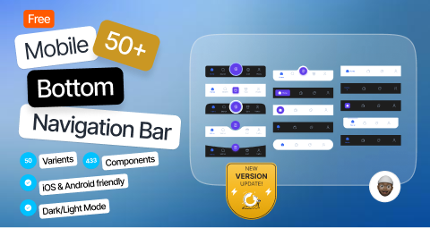

# 50 Mobile Bottom Navigation Bar (Community)

**Source:** Figma file `M2sDsZ75wzGq0hensLfRrx`
**Captured:** 2026-05-19
**Absorbed:** 2026-05-22 (platform-aware lens)
**Priority:** medium (re-bucketed from skip)
**Status:** absorbed — no new components; canonical bottom-nav reference



> Grounded by [`design/platform-awareness.md`](../../design/platform-awareness.md).
> A focused 6-page catalog of **50 bottom-navigation bar variants**
> in light + dark. Anchor reference for the future `TuxTabBar`
> shape when Tauri Mobile (iOS or Android) lands.

## What it is

A swatch sheet of **52 bottom-nav variants** (the "50" in the
title is loose) showing every conceivable shape: flat 3-tab, 4-tab
with center FAB, 5-tab with badge, curved "notch" bar, floating
pill, segmented, expanded-on-active, etc.

Useful primarily as a **shape catalog** — it confirms that the
canonical Android + iOS bottom nav is one of two shapes:
1. **Flat 3-5 tab bar** (Material-style)
2. **Floating pill 3-4 tab bar** (iOS 26 / Liquid Glass-style)

## Pages (6)

- `0:1` — Cover _(skip)_
- `0:6` — Sample _(5 frames — bar embedded in mock apps)_
- `0:5` — **Bottom Navigation Bar Library** _(52 frames — the
  catalog)_
- `218:4923` — Articles, best practices _(4 frames — author notes)_
- `101:2249` — Buy me coffee _(skip)_
- `4:1851` — Connect with me _(skip)_

## The canonical TUX `TuxTabBar` shape

After scanning the 52 variants, the right TUX shape is the
**flat or floating pill, 3-5 tabs, icon + label**:

```
┌──────────────────────────────────────────────┐
│  ◯       ◯       ◯       ◯       ◯           │  icons (24×24)
│ Home    Search  Notes   Tasks   Profile      │  label (10pt)
└──────────────────────────────────────────────┘
   ↑
   active tab: filled icon, maroon underline (top edge),
   sm extra weight on label
```

**Sizing:**
- Height: 56-72px (Material spec ~80; iOS spec ~49+safe-area;
  pick 64 + safe-area-inset-bottom for TUX)
- Tab count: 3-5 (never 6+; collapses to drawer if more)
- Tap target: at least 44×44px per Apple HIG
- Active indicator: maroon top-edge rule (TUX signature)

## Skip

- **The "curved notch" variant** with a FAB protruding upward.
  Visually striking but accessibility-hostile (the FAB obscures
  the central tab). Don't ship.
- **The "expanded-on-active" variant** where the active tab
  swells horizontally. Too dynamic; conflicts with TUX restrained
  motion.
- **The pure-icon variants** without labels. Drops a11y; always
  pair icon + label.

## Absorb

1. **The canonical shape above.** Captures the consensus from 52
   variants distilled to the one TUX-appropriate form.

2. **Active-state convention: maroon top edge.** Not Material's
   underline-below, not iOS 26's filled glass pill. The
   **signature rule on top** is the TUX-brand expression of
   "you are here" — same rule shape used by `TuxBreadcrumbs`
   active and `TuxTabs` (already shipped).

3. **Safe-area-inset-bottom is non-negotiable.** On iOS, the home
   indicator sits below; on Android with gesture nav, the system
   gesture strip sits below. Both need
   `padding-bottom: env(safe-area-inset-bottom)` on the nav bar.

4. **3-5 tab count is canonical.** Below 3, use a top app bar
   only (no nav needed). Above 5, switch to a nav drawer / sidebar.

5. **No FAB-in-the-middle.** Hold the line.

## Tension

- **Variety temptation.** 52 variants is fun to browse; resist
  pulling several into the design. **One canonical shape** keeps
  TUX consistent across iOS and Android.
- **iOS-pill vs Material-flat.** iOS 26 has gone full Liquid
  Glass pill; Material 3 stays flat. TUX-on-iOS could opt into
  the pill on `[data-platform="ios"]`, but the default should be
  flat (works on both). Defer the pill variant until iOS-only
  polish is requested.

## Decisions

- **No new components today.**
- **`TuxTabBar` shape spec recorded above.** When Tauri Mobile
  lands, this is the build target.
- **Reject FAB-protrusion and expanded-active variants.** Document
  in the future `TuxTabBar` JSDoc.
- **Active state = maroon top-edge rule.** TUX signature.
- **Move file from skip → medium** in priority sets.

## Open follow-ups

- When `TuxTabBar` ships, this file's `0:5` (Bottom Navigation
  Bar Library) is the catalog to spot-check against. The
  canonical TUX shape is in §1 above.
