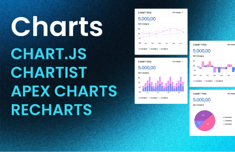

# 59 Charts UI Responsive Components Chart.js Chartist Apex Charts and Recharts (Community)

**Source:** Figma file `cgyhVbNMfmCkehk49v6leb`
**Captured:** 2026-05-19
**Priority:** skip
**Status:** stub — not yet absorbed

## Pages (2)

- `5:6381` — All You Need / Help / Start _(6 top-level frames)_
- `0:1` — All Charts Components _(18 top-level frames)_

## Skip

_TBD_

## Absorb

_TBD_

## Tension

_TBD_

## Decisions

_None yet._

## Open follow-ups

- Render previews of priority pages and write per-page NOTES.md
