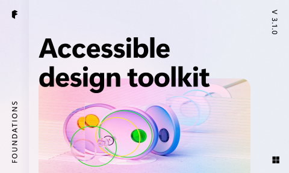

# Accessible design toolkit (Community)

**Source:** Figma file `YJvoW62sx5k02Nlat7ckco`
**Captured:** 2026-05-19
**Absorbed:** 2026-05-22
**Priority:** medium (re-bucketed; was skip — has real signal)
**Status:** absorbed — no new components; reaffirms a11y stance

> Reviewed during the post-platform-aware sweep to surface
> potential sleepers. Useful as an a11y-rubric reference — but
> TUX already has comparable docs under
> [`app/pages/accessibility/`](../../app/pages/accessibility/).

## What it is

A general-purpose **accessibility design toolkit** (v3.1.0) with a
plugin + design library for marking up Figma artifacts with
contrast, focus, target-size, and screen-reader rubrics. Pages:

- `208:186` — Introduction (1 frame)
- `22213:20806` — **Components & Guidance** _(7 frames — the real
  content: contrast / focus / target / SR rubrics)_
- `26516:29181` — Plugin + library owners guide _(2 frames)_
- `22213:20805` — Legacy separator
- `0:1` — Legacy components _(2 frames)_
- `38:0` — Legacy examples _(1 frame)_
- Change log + cover

## Pattern → TUX coverage

The seven Components & Guidance frames cover:

| Toolkit page | TUX coverage |
|---|---|
| Contrast ratio annotations (AA/AAA labels on swatch pairs) | [`app/pages/accessibility/contrast-matrix.vue`](../../app/pages/accessibility/contrast-matrix.vue) — shipped 2026-05-21; full TTI palette matrix with AA + AAA pass/fail at each combination |
| Focus-ring callouts | [`app/pages/accessibility/focus-model.vue`](../../app/pages/accessibility/focus-model.vue) — token-driven `--shadow-focus`, 3px maroon ring + 1px white inner |
| Touch / tap target size (44×44 min) | Documented in component-level showcase prose (`TuxTabBar`, `TuxFAB`, etc.); reaffirmed in platform-awareness doctrine |
| Skip-to-content link spec | [`app/pages/accessibility/skip-to-content.vue`](../../app/pages/accessibility/skip-to-content.vue) — shipped 2026-05-21 |
| Breakpoints reflow at 320px | [`app/pages/accessibility/breakpoints.vue`](../../app/pages/accessibility/breakpoints.vue) — shipped 2026-05-21; full ladder with WCAG 1.4.10 notes |
| Screen-reader-only utility class spec | `.sr-only` utility in Tailwind v4; documented via component JSDoc when used |
| Heading-order audit checklist | Conventions in `design/components.md` (eyebrow + heading hierarchy) |

## Skip

- **The Figma plugin itself.** It's a Figma authoring tool, not a
  Vue runtime artifact. Outside TUX's scope.
- **The legacy components page.** v2-era patterns; superseded by
  the current Components & Guidance frames.
- **Adopting their visual language.** The toolkit's marketing
  cover uses 3D-rendered prismatic objects — striking but not TUX.

## Absorb

1. **No new docs needed.** TUX already has four dedicated a11y
   doc pages covering the same ground:
   `accessibility/{index, contrast-matrix, focus-model,
   skip-to-content, breakpoints}.vue`. The toolkit's "Components &
   Guidance" frames are pattern-equivalent to what we ship.

2. **One small lesson:** the toolkit pairs each rubric with a
   **DO / DON'T** visual. TUX's current a11y pages lean on prose
   + token tables. If a future a11y pass adds a "common
   anti-patterns" gallery (DO vs DON'T side-by-side, like Apple
   HIG does), this file's `22213:20806` frames are the reference
   for the visual style.

3. **Confirms the four-rubric structure** we already ship
   (contrast / focus / target / SR) is the right canonical set.
   No restructuring needed.

## Tension

- **None substantive.** The toolkit and TUX's a11y docs are
  pattern-equivalent; the toolkit just happens to live in Figma
  while ours live in Vue. Different runtime, same content.

## Decisions

- **No new components, no new docs.** TUX accessibility coverage
  is current and aligns with the toolkit's rubrics.
- **Move file from skip → medium** in priority sets — it earned a
  proper audit on re-read (genuinely useful reference), even if
  the outcome is "we already do this."

## Open follow-ups

- If a future a11y pass adds a DO / DON'T visual gallery, source
  the style from this file's `22213:20806` frames. Defer until a
  contributor asks for it.
