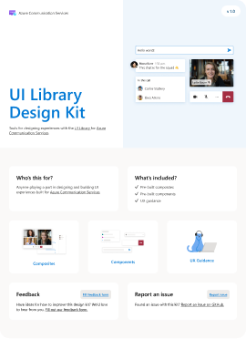

# ACS UI Library Design Kit (Community)

**Source:** Figma file `bbMWe7GfuYTTgCyELIWxY8`
**Captured:** 2026-05-19
**Priority:** skip
**Status:** stub — not yet absorbed

## Pages (4)

- `1815:982` — Get started _(1 top-level frames)_
- `1817:1015` —   ·  Composites _(3 top-level frames)_
- `1801:268` —   ·  Components _(8 top-level frames)_
- `417:0` —   ·  Themes _(1 top-level frames)_

## Skip

_TBD_

## Absorb

_TBD_

## Tension

_TBD_

## Decisions

_None yet._

## Open follow-ups

- Render previews of priority pages and write per-page NOTES.md
