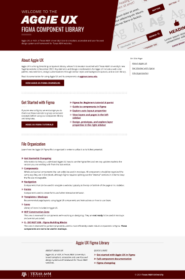

# Aggie UX Design System _ v1.7.0 (Community)

**Source:** Figma file `xYuVL47MvMDMbcNWyrOofU`
**Captured:** 2026-05-19
**Priority:** high
**Status:** absorbed — via CDN, not Figma

## How this was absorbed

**Aggie UX is already absorbed into TUX through a better channel.** The
Figma file is reference-only; the authoritative pull comes from the
TAMU public CDN at `aux.tamu.edu`:

- [`reference/aggieux/v2.0.1/aux-styles.css`](../../aggieux/v2.0.1) (523 KB,
  full system stylesheet)
- [`reference/aggieux/v2.0.1/aux-script.js`](../../aggieux/v2.0.1) (21 KB,
  component behaviors)
- [`reference/aggieux/icons/`](../../aggieux/icons) (411 SVGs, with
  categorized [`INDEX.md`](../../aggieux/icons/INDEX.md))
- Refresh script: `npm run sync:aggieux`
- Convention doc: [`reference/aggieux/README.md`](../../aggieux/README.md)

The CDN snapshot is **v2.0.1 (Pulled 2026-04-24)**. The Figma file is
labeled **v1.7.0** — older than what we have. Even if it matched
versions, CSS + JS + raw SVGs are more authoritative than Figma frames
for actual implementation.

## What the Figma file confirms

I rendered three small frames to spot-check consistency (visible in
this folder):

- `intro.png` — the Get Started page. Confirms TAMU MarComm ownership,
  the "Last updated 2024" version note, and the X-marked workspace pages
  ("DO NOT USE - Figma Building Blocks", "WIP Construction Zone") are
  internal-only.
- `navigation-search-block.png` — confirms AggieUX ships **two heading
  styles** for the same component (caps-bold `SEARCH HEADING` and
  italic-display `SEARCH HEADING`). Right column shows their internal
  "mockup-mode" treatment (faded gray = don't ship). The maroon-outline
  input + maroon button is the signature pattern.
- `icons-brands.png` — confirms brand icons exist in 4 styles
  (outlined / filled / dark-fill / light-fill). Already present as SVG
  in `reference/aggieux/icons/`.

Nothing in the Figma file is missing from the CDN absorption.

## Pages (8)

| ID | Name | Top-level children | Notes |
|---|---|---:|---|
| `971:119396` | Get Started & Changelog | 6 | Brand identity overview; mostly docs |
| `333:33107` | Navigation | 11 | Search/nav blocks, header/footer; mostly section-level |
| `249:34406` | Components | 42 | Buttons, cards, forms, modals — the bulk |
| `249:34381` | Specialized | 13 | Page-header treatments, hero patterns |
| `172:7654` | Templates / Mockups | 6 | Full-page assemblies (News etc.) |
| `13:2751` | Icons | 38 | Brand + UI icons; we have all 411 as SVG already |
| `252:33385` | X - DO NOT USE - Figma Building Blocks | 56 | Internal Figma-only scaffolding — skip |
| `959:123318` | X - DELETE THIS - WIP Construction Zone | 29 | Internal WIP — skip |

## Skip

- The two `X -` prefixed pages (Aggie's own convention says: do not
  consume)
- The Templates / Mockups page — full-page assemblies are AggieUX's
  visual identity. TUX deliberately does **not** copy these
  (the README in `reference/aggieux/` explains why: "we borrow editorial
  rhythm, not full Aggie visual identity")

## Absorb

Everything in this column has already been absorbed via the CDN +
`aggieux.css` path; this section catalogs *which TUX surfaces inherit
which AggieUX idea* so we can trace lineage:

- **Two heading-style variants per editorial component.** AggieUX's
  twin `SEARCH HEADING` treatments (caps-bold vs. italic display)
  inspire TUX's twin `TuxSectionHeader` variants (gold underline /
  maroon underline scoped to text width) — see
  [`design/tux.md`](../../../design/tux.md) → "Signature moves".
- **The gold underline rule under editorial headings.** Direct
  AggieUX borrow — TUX's slim 64×3 / 88×3 rule is the same idea at
  a more refined weight.
- **Brand-icon variant grid (outlined/filled/dark/light).** Already
  present in our icons under `reference/aggieux/icons/` and surfaced
  via Iconify per the aggieux README guidance.
- **Maroon-bordered inputs with maroon-fill buttons.** TUX uses TTI
  maroon (`#5C0025`) where AggieUX uses TAMU maroon — same pattern,
  different anchor.

## Tension

- **Aggie UX is Aggie-branded, not TTI-branded.** TUX inherits the
  *editorial rhythm* but not the Corps aesthetic. We do not adopt
  Aggie maroon, Open Sans body text, or the templates/mockups page
  wholesale. The
  [`reference/aggieux/README.md`](../../aggieux/README.md) section
  "Why not load them" articulates this clearly — keeping it as the
  durable answer.
- **Version drift.** Figma says v1.7.0 (2024); CDN says v2.0.1
  (2026-03). When upstream ships a new major, bump the
  `reference/aggieux/v{semver}/` directory rather than overwriting,
  so we can diff. Figma is unlikely to be useful for diffs (different
  authoring track).

## Decisions

Already landed before this Figma deep-dive (no new ones from this pass):

- `reference/aggieux/` directory structure + `npm run sync:aggieux`
- The "borrow editorial rhythm, not full identity" guidance in
  [`reference/aggieux/README.md`](../../aggieux/README.md)
- Gold-bar rule, twin section-header variants, icon Iconify path
  per [`design/tux.md`](../../../design/tux.md)

## Open follow-ups

- None specific to the Figma file. The CDN sync is the long-running
  path. Next refresh: when `aux.tamu.edu` publishes a new minor or
  major (we're on 2.0.1 today).
