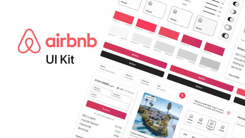

# Airbnb UI Kit (Community)

**Source:** Figma file `XScQMiZT4hxlm79eGyFrIY`
**Captured:** 2026-05-19
**Absorbed:** 2026-05-22
**Priority:** skip (audited)
**Status:** absorbed — no new components; consumer-travel kit, wrong register

> Reviewed during the coverage-gap audit (2026-05-22) — was the
> only stub file from the original skip-bucket that hadn't been
> covered in [`../SKIP-RATIONALE.md`](../SKIP-RATIONALE.md).
> Closes the absorption pipeline at 70/70 triaged.

## What it is

A 21-page community Figma file documenting Airbnb's consumer-travel
design language: accordion, buttons, cards, callouts, checkboxes,
chips, dropdowns, inputs, navigation, reviews, radio buttons, tabs,
toggles, tooltips, tiles.

Pages cover the standard atom catalog plus three foundation pages
(Colors & Typography, Elevation) and a Reviews page that's the only
genuinely consumer-travel-specific surface in the kit.

## Pages (21)

- `0:1` — Cover _(2 frames)_
- `208:2874` — Components _(15 frames — atom catalog)_
- `239:3762` — Colors & Typography _(2 frames)_
- `245:3354` — Elevation _(3 frames)_
- `35:1733` — Accordion _(4 frames)_
- `67:1332` — Buttons _(12 frames)_
- `129:1355` — Card _(1 frame)_
- `144:1886` — Callout _(2 frames)_
- `35:1851` — Checkbox _(2 frames)_
- `169:1479` — Chips _(2 frames)_
- `208:2826` — Drop Down _(3 frames)_
- `157:2994` — Inputs _(16 frames)_
- `150:2325` — Navigation _(1 frame)_
- `174:1464` — **Reviews** _(1 frame — consumer-travel-specific)_
- `157:2545` — Radio Buttons _(2 frames)_
- `150:2327` — Tabs _(2 frames)_
- `66:1310` — Toggle _(2 frames)_
- `174:1437` — Tooltip _(2 frames)_
- `148:2054` — Tiles _(4 frames)_

## Pattern → TUX coverage

Every Airbnb atom maps cleanly to a Nuxt UI 4 primitive or
existing Tux component:

| Airbnb pattern | TUX coverage |
|---|---|
| Accordion | `TuxAccordion` / `UAccordion` |
| Buttons | `TuxButton` / `UButton` |
| Card | `TuxCard` |
| Callout | `TuxCallout` |
| Checkbox | `UCheckbox` |
| Chips | `TuxRemovableChip` (interactive) / `TuxBadge` (decorative) |
| Drop Down | `UDropdownMenu` / `USelectMenu` |
| Inputs | `UInput` / `UTextarea` |
| Navigation | `TuxSiteNav` + `TuxDropdown` / `TuxMegaMenu` |
| Radio Buttons | `URadioGroup` |
| Tabs | `TuxTabs` / `UTabs` |
| Toggle | `USwitch` |
| Tooltip | `TuxTooltip` |
| Tiles | `TuxCard` (linked variant) / `TuxIconFeature` |
| **Reviews** | (no equivalent — not a TTI surface) |

## Skip

- **The whole kit.** TUX is research-publishing and BI-platform;
  Airbnb is consumer-travel. The atom shapes are the same, but
  the **rhythm and identity** are categorically different:
  - Airbnb: bright photography, soft-rounded cards, mid-saturation
    pinks/teals, friendly micro-copy, search-driven discovery.
  - TUX: maroon + paper-grain + display-face titles + hairline
    rules + real research photography + numerical density.
- **The Reviews component** specifically — TUX doesn't surface
  user reviews. Research artifacts have citations + sources
  (covered by `TuxCitations` + `TuxInlineCitation`), not reviews.
- **Bright photography aesthetic.** TTI uses real corridor /
  research photography, not curated travel imagery. The visual
  register doesn't transfer.

## Absorb

- **None.** Airbnb's design system is well-executed for its
  product, but the product is fundamentally wrong-register for
  TUX. The atom-level patterns are already covered.

## Tension

- **"Polished consumer-app patterns are tempting."** Same lesson
  as the Snow Dashboard / Dashboard-Free absorptions: great
  visual polish for a different product is still wrong for TUX.
  Hold the editorial-research line.

## Decisions

- **No new components.** Atom-level patterns covered; product
  shape doesn't transfer.
- **Update SKIP-RATIONALE.md** to include Airbnb explicitly
  (closes a coverage gap noted 2026-05-22).
- **Keep priority at skip.**

## Open follow-ups

- None. Audit closed.
