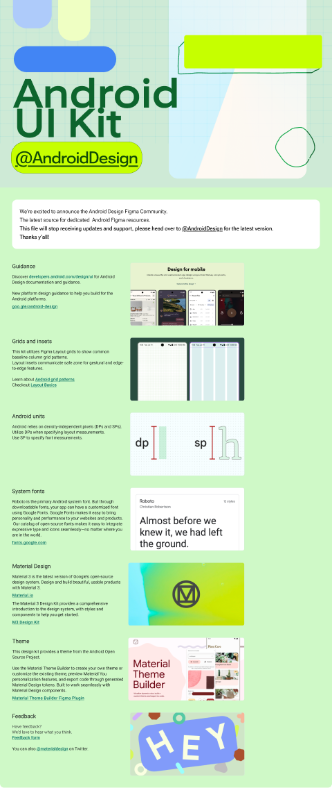

# Android UI Kit (Community)

**Source:** Figma file `8lAR3eebfnw9GB57I7sa8q`
**Captured:** 2026-05-19
**Priority:** skip
**Status:** stub — not yet absorbed

## Pages (8)

- `0:1` — Guide _(5 top-level frames)_
- `591:4066` — --- _(0 top-level frames)_
- `1:65` — Styles _(3 top-level frames)_
- `591:4067` — --- _(0 top-level frames)_
- `337:27122` — Communication _(7 top-level frames)_
- `341:27123` — Core App _(2 top-level frames)_
- `337:23462` — Navigation & Settings _(4 top-level frames)_
- `1:6609` — Camera & Media _(1 top-level frames)_

## Skip

_TBD_

## Absorb

_TBD_

## Tension

_TBD_

## Decisions

_None yet._

## Open follow-ups

- Render previews of priority pages and write per-page NOTES.md
