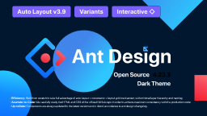

# Ant Design Open Source (Community)

**Source:** Figma file `hfEmLZQ7gZk3cZf3YML67A`
**Captured:** 2026-05-19
**Priority:** skip
**Status:** stub — not yet absorbed

## Pages (70)

- `92:0` — Ant Design _(25 top-level frames)_
- `3603:28924` — Components Overview _(62 top-level frames)_
- `1413:14459` — 📦 Templates & Pages _(24 top-level frames)_
- `110:0` — Colors _(4 top-level frames)_
- `1136:0` — ━ General ━━━━━━━━━━━━ _(0 top-level frames)_
- `1:3` —     Button _(12 top-level frames)_
- `73:1` —     Icon _(8 top-level frames)_
- `473:956` —     Typography _(9 top-level frames)_
- `1136:1` — ━ Layout ━━━━━━━━━━━━━ _(0 top-level frames)_
- `0:1` —     Grid _(6 top-level frames)_
- `354:7` —     Divider  _(5 top-level frames)_
- `1:2` —     Layout _(38 top-level frames)_
- `479:19` —     Space _(5 top-level frames)_
- `1139:10055` — ━ Navigation ━━━━━━━━━━━ _(0 top-level frames)_
- `18:1176` —     Breadcrumb  _(7 top-level frames)_
- `209:13` —     Dropdown  _(15 top-level frames)_
- `233:8008` —     Menu _(32 top-level frames)_
- `966:0` —     PageHeader _(8 top-level frames)_
- `212:148` —     Pagination _(12 top-level frames)_
- `238:780` —     Steps _(11 top-level frames)_
- `1139:10056` — ━ Data Entry ━━━━━━━━━━━ _(0 top-level frames)_
- `53122:15` —     AutoComplete _(4 top-level frames)_
- `826:4193` —     Cascader _(8 top-level frames)_
- `91:4` —     Checkbox _(9 top-level frames)_
- `1277:4535` —     DatePicker _(13 top-level frames)_
- `234:0` —     Form _(38 top-level frames)_
- `637:35` —     Input _(20 top-level frames)_
- `205:602` —     InputNumber _(8 top-level frames)_
- `118:0` —     Radio _(12 top-level frames)_
- `1349:14935` —     Rate _(6 top-level frames)_
- `6908:60704` —     Select _(10 top-level frames)_
- `7604:73673` —     Slider _(14 top-level frames)_
- `506:0` —     Switch _(9 top-level frames)_
- `753:1582` —     TimePicker _(9 top-level frames)_
- `745:2809` —     Transfer _(12 top-level frames)_
- `532:2026` —     TreeSelect _(4 top-level frames)_
- `1284:13702` —     Upload _(16 top-level frames)_
- `1139:10057` — ━ Data Display ━━━━━━━━━━ _(0 top-level frames)_
- `1127:10813` —     Badge _(13 top-level frames)_
- `1124:0` —     Avatar _(6 top-level frames)_
- `1192:10060` —     Calendar _(10 top-level frames)_
- `16020:12` —     Card _(6 top-level frames)_
- `3595:0` —     Carousel _(9 top-level frames)_
- `742:2684` —     Collapse _(7 top-level frames)_
- `1131:39` —     Comment _(9 top-level frames)_
- `459:29` —     Descriptions _(28 top-level frames)_
- `797:0` —     Empty _(9 top-level frames)_
- `15812:0` —     Image _(5 top-level frames)_
- `1170:1408` —     List _(12 top-level frames)_
- `101240:0` —     Popover _(5 top-level frames)_
- `155198:157606` —     Segmented _(6 top-level frames)_
- `1110:9876` —     Statistic _(8 top-level frames)_
- `36:10` —     Table _(52 top-level frames)_
- `45:163` —     Tabs _(32 top-level frames)_
- `45:1735` —     Tag _(11 top-level frames)_
- `1385:15071` —     Timeline _(8 top-level frames)_
- `6636:0` —     Tooltip _(5 top-level frames)_
- `548:0` —     Tree _(16 top-level frames)_
- `1140:10052` — ━ Feedback ━━━━━━━━━━━ _(0 top-level frames)_
- `1169:2` —     Alert _(4 top-level frames)_
- `40022:87913` —     Drawer _(4 top-level frames)_
- `705:0` —     Message _(4 top-level frames)_
- `628:0` —     Modal _(10 top-level frames)_
- `732:9` —     Notification _(4 top-level frames)_
- `1056:9809` —     Popconfirm _(4 top-level frames)_
- `1020:7960` —     Progress _(23 top-level frames)_
- `1065:9895` —     Result _(8 top-level frames)_
- `9915:0` —     Skeleton _(8 top-level frames)_
- `1148:0` — ━ Other ━━━━━━━━━━━━━ _(0 top-level frames)_
- `6748:59388` —     Anchor _(7 top-level frames)_

## Skip

_TBD_

## Absorb

_TBD_

## Tension

_TBD_

## Decisions

_None yet._

## Open follow-ups

- Render previews of priority pages and write per-page NOTES.md
