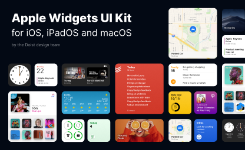

# Apple Widgets UI Kit (Community)

**Source:** Figma file `CMD3wL5TlhBOPwfrEPxFjn`
**Captured:** 2026-05-19
**Priority:** skip
**Status:** stub — not yet absorbed

## Pages (5)

- `73:899` — Thumbnail _(1 top-level frames)_
- `0:1` — UI Mockups _(18 top-level frames)_
- `6:59` — Widgets _(68 top-level frames)_
- `10:12` — iOS 14 Wallpaper _(5 top-level frames)_
- `10:23` — iPhone Frames _(4 top-level frames)_

## Skip

_TBD_

## Absorb

_TBD_

## Tension

_TBD_

## Decisions

_None yet._

## Open follow-ups

- Render previews of priority pages and write per-page NOTES.md
