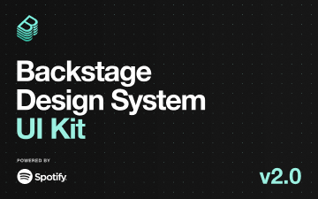

# Backstage Design System (Community)

**Source:** Figma file `klQR4pWIxJ45p4m9xG87N9`
**Captured:** 2026-05-19
**Priority:** high
**Status:** absorbed — completeness pass; 0 new components, all patterns covered

## What it actually is

Spotify's open-source design system for the **Backstage** developer-portal
framework. Internal-tooling focus: API catalogs, plugin marketplaces,
service health dashboards, build / deploy status panels. v2.0 UI kit.

27 pages. Frames rendered for visual reference: `color-ui.png`,
`trendline-light.png`, `side-panel.png`, `empty-card.png`.

## Coverage check — 27 pages against TUX + Nuxt UI 4

The expected outcome for this pass was "0–1 small finds." Result: **0
new components needed.** Every Backstage pattern is already covered.

| Backstage | TUX / Nuxt UI 4 |
|---|---|
| **Color** — 12 neutrals + 5 semantic (red / orange / yellow / green / blue) | `design/tokens.json` color palette (TTI maroon + gold + semantic tones) |
| **Type** | TUX type tokens + TuxProse |
| **Buttons** | `TuxButton` (4 intents) / `UButton` |
| **Cards** | `TuxCard` / `TuxCardSlab` |
| **Chips** | `TuxRemovableChip` / `TuxBadge` |
| **Dismissable Banner** | `TuxAnnouncementBanner` |
| **Empty States** (6 variants: card, table, page, builds, entity-not-found, create-component) | `TuxEmptyState` (default + `compact` for in-card / in-table cases — validated by Backstage's Empty Card pattern) |
| **Error States** | `TuxErrorPage` |
| **Filters** | `TuxFilterPanel` |
| **Form Validation** (38 frames — dialogs, inline error, banner) | `UFormField` + `TuxAlert` + `UModal` composition |
| **Grid** | CSS / Tailwind |
| **Header (w/ Breadcrumbs)** | `TuxPageHeader` + `TuxBreadcrumbs` |
| **Homepage** | `app/pages/index.vue` composition idiom |
| **Progress** | `UProgress` |
| **Side Navigation** | `UDashboardSidebar` (via `app/layouts/sidebar.vue`) + `TuxDocsSidebar` for doc-site nav |
| **Side Panel** (34 frames — slide-in panels with lightbox / no-lightbox modes) | `TuxSlideover` + `USlideover` |
| **SimpleStepper** | `TuxStepper` |
| **Status** | `TuxBadge` (status mode with running / completed / failed / queued + dot indicator) |
| **Table** | `TuxTable` / `TuxDataTable` / `TuxRichDataGrid` |
| **Tabs** | `UTabs` |
| **Trendline** (3 directional variants: up / down / mixed) | `TuxSparkline` already covers this — see Tension below |
| **Backstage Logo, Create a Plugin** | Brand-specific / developer-platform-specific; not TUX use cases |

## Skip

- **Backstage Logo** — Spotify's own brand. Not consumable.
- **Create a Plugin** — Backstage's plugin-development onboarding flow. Not relevant to TTI.
- **Homepage** — Backstage's specific welcome-page composition; covered conceptually by TUX's editorial composition patterns.

## Absorb

### Pattern confirmations (no code changes)

- **Empty States as compact variants inside cards/tables.** Backstage's
  Empty Card (`empty-card.png`) shows the same use case as the
  `compact` variant we shipped to
  [`TuxEmptyState`](../../../app/components/TuxEmptyState.vue) during the
  Primer pass. Independent confirmation that the variant was the right
  call.
- **Three-state trendlines** (up / down / mixed) with semantic color +
  area fill. [`TuxSparkline`](../../../app/components/TuxSparkline.vue)
  already has `tone="success" | "error" | "warning" | "neutral" | "brand"`
  + `showArea` + last-point marker — every Backstage trendline variant
  is reachable by passing the appropriate `tone`.

## Tension

### `TuxSparkline` doesn't auto-color by trend direction

Backstage's Trendline component is opinionated: it picks the color
automatically based on the data direction (last value vs. first
value). `TuxSparkline` requires the consumer to pass `tone` manually.
That's slightly less ergonomic for the common "show whether this
metric is going up or down" case.

**Resolution:** small `autoTone?: boolean` prop would cover this in
~10 LOC. **Defer** — no current consumer surface forces the question,
and explicit `tone` is more honest about what the chart is saying.
Consumer-derived "if last > first, success" logic is one line anyway.

## Decisions

- Designated Backstage as the **completeness reference** — confirms
  TUX + Nuxt UI 4 covers the developer-platform UI surface area. No
  new components warranted by this pass
- Did **not ship** a `TuxSparkline.autoTone` prop. Defer until consumer
  surface demands

## Open follow-ups

1. **`TuxSparkline.autoTone` prop** — only if a consumer surface needs
   automatic up/down/mixed coloring. Likely never; explicit tone is
   already terse
