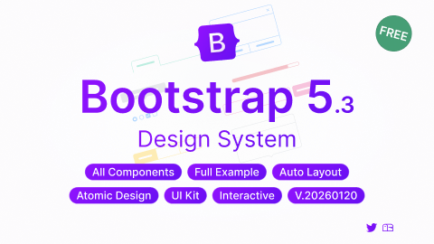

# Bootstrap 5 Design System - UI Kit (Community)

**Source:** Figma file `YBInPH24P27EWgrxjVaQi4`
**Captured:** 2026-05-19
**Priority:** skip
**Status:** stub — not yet absorbed

## Pages (62)

- `0:1` — ⬓ Cover _(2 top-level frames)_
- `1132:453592` — ❤︎ Support _(1 top-level frames)_
- `3:193135` — 🕮 Document _(10 top-level frames)_
- `3:193136` — 🎨 Templates & Pages _(4 top-level frames)_
- `4:192618` — ━ GENERAL ━━━━━━━━━━━━ _(0 top-level frames)_
- `4:192619` —     Colors & Shadow _(2 top-level frames)_
- `4:192620` —     Typography _(5 top-level frames)_
- `4:192621` —     Icons _(2133 top-level frames)_
- `4:192622` — ━ LAYOUT ━━━━━━━━━━━━━ _(0 top-level frames)_
- `4:192623` — ★ Layout _(32 top-level frames)_
- `4:192624` — ]I[ Spacing _(4 top-level frames)_
- `4:192626` — ⌗ Grid _(11 top-level frames)_
- `4:192627` — ━ COMPONENTS ━━━━━━━━━━━ _(0 top-level frames)_
- `4:192628` — ❖ Accordion _(3 top-level frames)_
- `4:192629` — ❖ Alerts _(2 top-level frames)_
- `4:192630` — ❖ Badge _(2 top-level frames)_
- `4:192631` — ❖ Breadcrumb _(5 top-level frames)_
- `4:192632` — ❖ Buttons _(4 top-level frames)_
- `4:192633` — ❖ Button group _(3 top-level frames)_
- `4:192634` — ❖ Card _(2 top-level frames)_
- `4:192635` — ❖ Carousel _(7 top-level frames)_
- `4:192636` — ❖ Close button _(3 top-level frames)_
- `4:192637` — ❖ Collapse _(2 top-level frames)_
- `4:192638` — ❖ Dropdowns _(8 top-level frames)_
- `4:192625` — ❖ Divider _(1 top-level frames)_
- `4:192639` — ❖ List group _(3 top-level frames)_
- `4:192640` — ❖ Modal _(16 top-level frames)_
- `4:192642` — ❖ Navbar _(9 top-level frames)_
- `4:192641` — ❖ Navs & Tabs _(23 top-level frames)_
- `4:192643` — ❖ Offcanvas _(7 top-level frames)_
- `4:192644` — ❖ Pagination _(6 top-level frames)_
- `4:192645` — ❖ Placeholders _(3 top-level frames)_
- `4:192646` — ❖ Popovers _(9 top-level frames)_
- `4:192647` — ❖ Progress _(3 top-level frames)_
- `4:192648` — ❖ Scrollspy _(0 top-level frames)_
- `4:192649` — ❖ Spinners _(2 top-level frames)_
- `4:192650` — ❖ Toasts _(3 top-level frames)_
- `6:192652` — ❖ Tooltips _(8 top-level frames)_
- `6:192653` — ━ FORMS ━━━━━━━━━━━━━ _(0 top-level frames)_
- `6:192654` — ❖ Form _(41 top-level frames)_
- `3732:422786` — ❖ Floating labels _(5 top-level frames)_
- `6:192655` — ❖ Checks & Radios & Switches _(10 top-level frames)_
- `6:192656` — ❖ Color Picker _(3 top-level frames)_
- `6:192657` — ❖ Date Picker _(5 top-level frames)_
- `1297:453181` — ❖ Time Picker _(3 top-level frames)_
- `7:192658` — ❖ Datalist _(1 top-level frames)_
- `7:192659` — ❖ Input _(13 top-level frames)_
- `7:192660` — ❖ Input Number _(4 top-level frames)_
- `7:192661` — ❖ Range _(6 top-level frames)_
- `7:192662` — ❖ Rate _(3 top-level frames)_
- `7:192663` — ❖ Select _(7 top-level frames)_
- `7:192665` — ❖ Upload _(8 top-level frames)_
- `7:197012` — ━ CONTENT ━━━━━━━━━━━━━ _(0 top-level frames)_
- `7:197013` — ❖ Images _(4 top-level frames)_
- `7:197014` — ❖ Tables _(49 top-level frames)_
- `7:197015` — ❖ Figures _(2 top-level frames)_
- `202:214802` — ━ EXTRA ━━━━━━━━━━━━━ _(0 top-level frames)_
- `202:214803` — ❖ Avatar _(2 top-level frames)_
- `202:215493` — ❖ Comment _(4 top-level frames)_
- `202:215494` — ❖ Empty _(4 top-level frames)_
- `202:215535` — ❖ Tags _(2 top-level frames)_
- `7:192664` — ❖ Transfer _(5 top-level frames)_

## Skip

_TBD_

## Absorb

_TBD_

## Tension

_TBD_

## Decisions

_None yet._

## Open follow-ups

- Render previews of priority pages and write per-page NOTES.md
