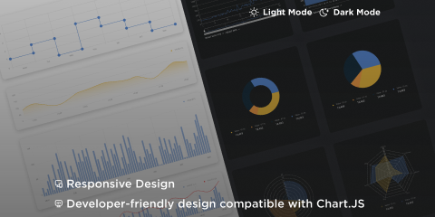

# Charts UI Kit (Community)

**Source:** Figma file `7vg6jSs8ddBYYSGNIwg8yr`
**Captured:** 2026-05-19
**Absorbed:** 2026-05-21
**Priority:** medium
**Status:** absorbed — no new components

## What it is

A single-screen chart-type sampler in light + dark themes
(`charts/charts-light.png`, `charts/charts-dark.png`). Markets
itself as "developer-friendly design compatible with Chart.JS."
Not a design system — a swatch sheet of chart shapes.

## Pages (3)

- `0:1` — 💫 Cover _(1 frame)_
- `1:3` — 📈 Charts _(Charts/Light + Charts/Dark — same set, two themes)_
- `9:1422` — 🍸 Presentation _(portfolio cover, no new content)_

## Inventory observed

Chart shapes on the Charts page, with TUX status alongside:

| Shape | TUX status |
|---|---|
| Step-line with point markers | Not built; falls under roadmap **TuxChartLine** (Priority B) — variant flag |
| Smoothed area (single series) | Not built; future **TuxChartArea** sibling of TuxChartLine |
| Bar chart (vertical, single series) | Not built; roadmapped **TuxChartBar** (Priority B) |
| Combined bar + line overlay | Not built; future composition on TuxChartBar + TuxChartLine |
| Line chart (single series, markers) | Not built; roadmapped **TuxChartLine** |
| Time-series + brush/range selector | New pattern — see Absorb |
| KPI strip over stacked area | TUX gestures at this via TuxBigStat next to TuxSparkline; richer form belongs in future docs |
| Donut chart | Not built; future **TuxChartDonut** |
| Pie chart | Not built; future **TuxChartPie** (or skip — donut is preferred at TTI) |
| Polar / wind-rose | Not built; niche — defer until a corridor-data consumer needs it |
| Radar chart | Not built; future **TuxChartRadar** |

## Skip

- **Their chart palette** (gold #FAB / blue #6B7 / navy + neutrals).
  TUX already has `--chart-1..8` maroon-led tokens in
  `app/assets/css/tokens.css` (lines 246–253 base, lifted variants
  for dark + HC). The source of truth stays.
- **Chart.JS positioning.** TUX's native charts are SVG with our own
  rendering (cf. TuxSparkline, TuxChartGeographic, TuxChartSunburst).
  No move to Chart.JS.
- **Light-touch visual character.** Their charts are deliberately
  minimal-chrome. TUX charts default to editorial chrome via
  `TuxChartFrame` (eyebrow / display title / signature rule / source).

## Absorb

1. **Brush / range selector on time-series.** The bottom strip with
   draggable handles below the time-series chart is a real
   interaction we'd want for any Landscape (formerly PECAN)
   long-window metric. When **TuxChartLine** ships, add an optional
   `range` slot or `withBrush` prop that renders a sub-strip with
   dimmed full series + draggable window. Mark in chart-foundations
   doc once it exists.
2. **KPI strip over stacked area.** The "Total Data · Data A · Data B"
   big-stats row anchored above a stacked area is the canonical
   "summary + trend" composition. TUX has the pieces (TuxBigStat +
   TuxSparkline + future TuxChartArea); the absorption is to call out
   this composition in `chart-foundations` whenever that doc lands.
3. **Confirmation of the inventory.** Bar / line / area / donut /
   radar is exactly the Priority B roadmap. No surprises; no shift
   in priority order. Pie stays optional (donut preferred for label
   clarity at TTI).

## Tension

- **"Developer-friendly Chart.JS" vs editorial native SVG.** Their
  whole pitch is "drop into a Chart.JS app." Our pitch is
  "first-class native rendering with theme-aware tokens + screen-
  reader summaries." Different audiences. Don't let the Figma file
  pull TUX toward a chart-library wrapper posture.
- **Palette restraint vs categorical pop.** Their palette has high
  saturation + tertiary hues for category encoding. TUX's
  `--chart-1..8` is intentionally muted with maroon as the anchor.
  Resist the urge to "brighten for legibility" — the dark + HC
  variants in `tokens.css` already handle that translation.

## Decisions

- **No new components from this file.** The chart inventory is
  already roadmapped in `design/roadmap.md` Priority B (TuxChartBar,
  TuxChartLine, TuxChartScatter). Building them requires real
  Landscape data + a `chart-foundations` doc + accessibility
  patterns — that's a multi-day push, not a Figma-absorption sprint.
- **Carry the brush-selector + KPI-strip patterns** as roadmap notes
  on the eventual TuxChartLine / TuxChartArea entries, not as
  standalone components.
- **Palette tokens stay maroon-led.** Re-affirm; don't drift.

## Open follow-ups

- When **TuxChartLine** ships, design the `withBrush` (or `#range`
  slot) affordance. Reference frame: this file's time-series.
- When **TuxChartArea** ships, support a stacked variant with a
  KPI strip composed above via parent template (don't bake it in;
  the composition is the value).
- Add a future row to `design/components.md` under "Conventions" for
  "Chart with summary KPIs above" once a real consumer surface
  demands it. Hold off until Landscape forces the question.
