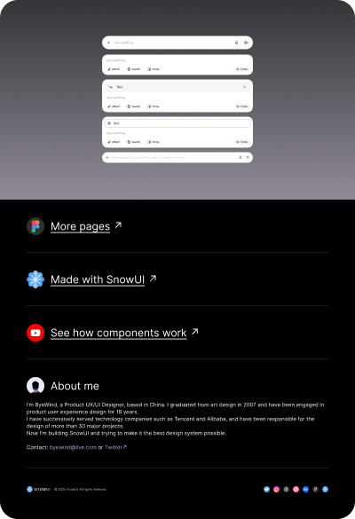

# Chat Input Box (Community)

**Source:** Figma file `IRqWt0cn37ySESHUptUrML`
**Captured:** 2026-05-19
**Priority:** medium
**Status:** stub — not yet absorbed

## Pages (4)

- `1:2` — 🔶 Components _(16 top-level frames)_
- `33:647` — 🟡 Design system _(2 top-level frames)_
- `1:3` — ❄️ Made with SnowUI _(1 top-level frames)_
- `0:1` — 🔶 Cover _(1 top-level frames)_

## Skip

_TBD_

## Absorb

_TBD_

## Tension

_TBD_

## Decisions

_None yet._

## Open follow-ups

- Render previews of priority pages and write per-page NOTES.md
