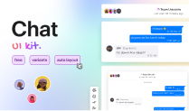

# Chat UI kit (Community)

**Source:** Figma file `OjCTkYvAhLCpoH2dwtDJ8e`
**Captured:** 2026-05-19
**Absorbed:** 2026-05-21
**Priority:** medium
**Status:** absorbed — 0 new components; confirms canonical messenger pattern

## What it is

A small SaaS-messenger sampler — 4 component frames (header, footer,
message frame, message bubble) on a single Components page. Slack /
Intercom flavor: avatar gutter, day separator, current-user bubbles
right, others left, composer at bottom.

## Pages (2)

- `0:1` — 💫 Cover _(thumbnail)_
- `2:2` — Components _(4 frames: header, footer, Message frame,
  Message bubble component set)_

## Frames inspected

`components/`:
- `header.png` — channel-title header with avatar stack, "5 members,
  X minutes ago" meta, three-dot menu
- `footer.png` — "Start typing…" input with attach + emoji + send
- `message-frame.png` — full conversation: day header, multi-author
  thread with avatars + role + timestamp, current-user blue bubbles
  right-aligned
- `message-bubble.png` — bubble variants (sent/received, with/
  without avatar header)

## Existing TUX + Nuxt UI 4 surface (audit before proposing)

- **`TuxChatMessage`** — author / role / avatar / body / footer
  + `#header-trailing` slot (branch nav, etc.) — shipped in the
  prior absorption pass
- **`TuxComposer`** — chat input with attach + send + toolbar slot
- **`TuxConversationList`** — sidebar list of conversations
- **`UChatMessage`** / **`UChatMessages`** / **`UChatPrompt`** /
  **`UChatPromptSubmit`** / **`UChatPalette`** — Nuxt UI 4
  primitives, already composed in `tti-ai-studio-session.vue`

The 4 component frames in this kit map one-to-one to surface TUX
already covers. Nothing net new.

## Skip

- **The chrome** — soft-shadow bubbles, blue current-user fill,
  emoji + attach + send-only footer. TUX is editorial-research
  (paper-grain, maroon-anchored); the SaaS-messenger gloss doesn't
  transfer.
- **The day-separator pattern as a top-level component.** Already
  composable with a small `<TuxSectionHeader compact>` or a custom
  `
` between message groups. No need for `TuxChatDaySeparator`.
- **Per-author multi-bubble grouping.** Same — the existing
  `TuxChatMessage` is one-bubble-per-instance; grouping is a host
  responsibility (concat consecutive same-author messages in the
  data layer or with a v-if check around the header block).

## Absorb

Effectively nothing. This is a single-screen sampler, not a design
system. Confirmation that TUX + Nuxt UI 4 chat surface covers the
canonical Slack/Intercom shape.

## Tension

- **Avatar gutter vs no avatar.** The kit puts a 32px avatar gutter
  on every message; TUX `TuxChatMessage` makes the avatar optional
  (assistant turns often omit it for tti-ai-studio's editorial
  feel). This is a *choice we deliberately make*, not a gap to fill.

## Decisions

- **No new components, no roadmap follow-ups.** The chat surface
  was already saturated before this absorption — see the prior
  Vercel AI Elements pass (5 new components shipped) and the
  Nuxt UI 4 audit.

## Open follow-ups

- _None._ This file's value is confirming we don't need to chase
  the Slack/Intercom pattern; we have it covered with editorial
  chrome instead.
