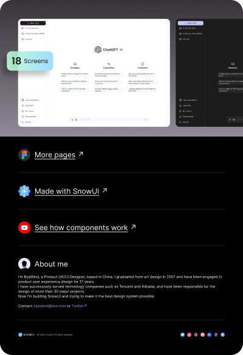

# ChatGPT UI Kit, AI Chat (Community)

**Source:** Figma file `tJG7ljkBW5zPFkFHRo8TQZ`
**Captured:** 2026-05-19
**Priority:** medium
**Status:** stub — not yet absorbed

## Pages (5)

- `665:2049` — 🟪 ChatGPT Web Client _(3 top-level frames)_
- `0:1` — 🟪 ChatGPT UI Kit _(3 top-level frames)_
- `609:5682` — 🟡 Design system _(2 top-level frames)_
- `501:3138` — ❄️ Made with SnowUI _(1 top-level frames)_
- `1:9655` — 🔶 Cover _(1 top-level frames)_

## Skip

_TBD_

## Absorb

_TBD_

## Tension

_TBD_

## Decisions

_None yet._

## Open follow-ups

- Render previews of priority pages and write per-page NOTES.md
