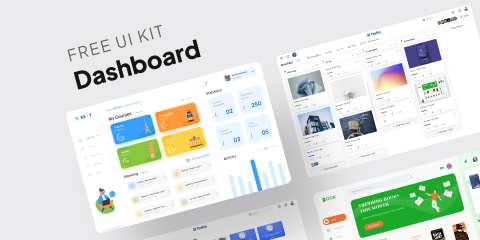

# Dashboard - Free UI Kit 🖥 (Community)

**Source:** Figma file `8yDlNoDgvKKnfc3i1RZIub`
**Captured:** 2026-05-19
**Absorbed:** 2026-05-22
**Priority:** medium
**Status:** absorbed — no new components

## What it is

A free dashboard kit (separate author from Snow) with three sample
flagship screens (Dashboard 1 main / Dashboard 2 bonus / Dashboard 3
bonus) plus a 25-frame Components page. Visual identity skews
"educational SaaS" — bright pastel KPI tiles (yellow/orange/blue),
illustrated empty-state mascots, soft drop shadows.

## Pages (7)

- `3:1299` — Thumbnail _(skip)_
- `26:3` — Dashboard 1 (main) _(9 frames — flagship)_
- `501:5552` — Dashboard 2 (bonus) _(1 frame)_
- `501:5553` — Dashboard 3 (bonus) _(1 frame)_
- `513:1738` — Components _(25 frames — atoms grid)_
- `508:1871` — Buy me a coffee! _(skip)_
- `168:1627` — Draft _(empty)_

## Mapping (delta vs Snow audit)

Patterns are 90% the same as Snow — the visual delta is the chrome,
not the composition. The remaining 10% (the educational-product
flavors) is product-specific.

| Dashboard-Free pattern | TUX coverage |
|---|---|
| Sidebar with section groups + active highlight | `app/layouts/sidebar.vue` — already shipped |
| KPI tile row with mascots / illustrations | `TuxBigStat` + `TuxFactoid` (no mascots — see Skip below) |
| Course-progress cards w/ thumbnail + progress bar + meta | Compose `TuxMediaCard` + `UProgress` — no new component |
| "Today's Schedule" stacked list w/ time-stamped rows | `UTimeline` (Nuxt UI) — already covered |
| Statistics donut + legend | Roadmap **TuxChartDonut** (Priority B) |
| Bar chart by month | Roadmap **TuxChartBar** (Priority B) |
| Image gallery / asset card row | `TuxPhotoGrid` + `TuxMediaCard` |
| Notifications drawer | Compose `USlideover` + `UTimeline` — no new component |

## Skip

- **Decorative mascot illustrations** in empty-states and KPI tiles
  (people pointing at charts, sitting on stacks of books). Already
  documented in `TuxEmptyState` audit + Empty State Illustration
  Kit absorption: TUX has a **"no decorative illustrations"
  stance**. Hold the line.
- **Pastel KPI tile fills** (saturated yellow / orange / blue). TUX
  uses paper-grain surface tokens + signature-rule emphasis, not
  flooded color tiles.
- **"Course-progress" framing.** TUX is research-publishing, not
  edtech. Skip the educational copy patterns.
- **Bright illustrated chrome.** Same lesson as Snow: the patterns
  transfer, the chrome doesn't.

## Absorb

1. **Multi-line stacked schedule list as a TuxFeed pattern.** The
   "Today's Schedule" stack (time-stamped rows + small image
   thumbnail + status pill) is the canonical "activity feed"
   composition. **`UTimeline` + custom slot content covers it** —
   no new component, but a future Conventions row in
   `design/components.md` for "activity feed composition" could
   help when Landscape's recent-runs panel gets fleshed out.
2. **Sidebar group + nested children + active-trail highlight.**
   Confirmed in `sidebar.vue` already. No change.
3. **Mini-table footer in a card.** The "Recent items" card with a
   sub-table inside a `TuxCard` is a pattern already used in
   Landscape's research-landing page. No change.

## Tension

- **Visual density.** Dashboard-Free goes heavy on color + mascots
  (high density of visual hooks). TUX prefers fewer hooks per
  screen, with the maroon signature rule + photography providing
  the visual anchor. Resist transplant temptation.

## Decisions

- **No new components.** Patterns map cleanly to existing primitives
  or Priority B chart entries.
- **No new doc entries** — `TuxEmptyState` already documents the
  "no decorative illustrations" stance, and `UTimeline` for activity
  feeds is implicit in current usage.
- **Downgrade priority** to skip on next INDEX rebuild. The file is
  visually distinct from Snow but pattern-equivalent.

## Open follow-ups

- If Landscape gets a daily "recent runs" or "today's events"
  surface, use `UTimeline` slot content with `TuxBadge` status pills.
  Reference Dashboard-Free's schedule list as the visual proportion
  (timestamp left, content middle, status right).
