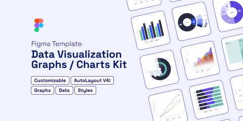

# Data Visualization Graphs / Charts Kit (Community)

**Source:** Figma file `XjVyug3U8o1Pp51jM6M51B`
**Captured:** 2026-05-19
**Absorbed:** 2026-05-21
**Priority:** medium
**Status:** absorbed — no new components, two pattern notes for future TuxChart\*

## What it is

A heavier chart-kit template (48 frames on the main page) that bills
itself as "Customizable · AutoLayout V4 · Graphs · Data · Styles."
Most of the variant content is **gated behind Pro** (RECTANGLE
placeholders labeled "🚀 Unlocked with Pro Template" — Treemap,
Pie, Area, additional Bar/Donut variants). Six frames are unlocked
and inspectable; renders in `dataviz/`.

## Pages (3)

- `55:2` — Welcome & Tutorial _(5 frames; setup screens, skip)_
- `0:1` — Data Viz Kit _(48 frames; the inventory)_
- `16:995` — Cover _(1 frame)_

## Unlocked frames inspected

`dataviz/`:
- `bar-1.png` — grouped vertical bars (3 series × 5 categories) with
  values written **inside** each bar
- `line-1.png` — 4-series line chart, dark theme, with **end-of-line
  value labels** colored to match the series ("123.2", "125.2", etc.)
- `line-3.png` — variant of line-1 (similar layout)
- `donut-1.png` — donut with legend in center, percent + label on
  each slice
- `donut-4.png` — donut variant
- `color-palette.png` — **8 hues × 6 lightness tiers**
- `styles.png` — text scale: Legend / Percent Out-bar / Percent
  In-bar / Label / Units of measure
- `autolayout-responsiveness.png` — autolayout demo (Figma-internal)

## Skip

- **The whole bright-saturated palette.** Their 8 hues are
  cobalt/violet/teal/yellow/red — same template energy as Charts UI
  Kit. TUX `--chart-1..8` is maroon-led and muted across light/dark/
  HC; that stays.
- **Pro-gated Treemap/Pie/Percent/Area variants.** We can only see
  outlines. Treemap is already named in TUX roadmap (sister to
  TuxChartSunburst); no point reverse-engineering a locked frame.
- **AutoLayout V4 pitch.** Figma-internal autolayout has no bearing
  on TUX implementation (we render SVG ourselves in
  TuxSparkline/Geographic/Sunburst; same for future TuxChart\*).

## Absorb

1. **End-of-line value labels colored to match the series.** The
   line-1 frame puts the final value at the right end of each line
   in the series color ("123.2" in violet next to the top line).
   This is **a real accessibility win**: identity carried by both
   color AND adjacent text, so the chart works for color-blind
   users without a legend hunt. Capture this as the
   **default behavior** for the eventual TuxChartLine — not optional.
2. **"Percent In-bar" vs "Percent Out-bar" as a documented choice.**
   Their styles page treats these as two named text styles —
   recognizing that the placement of a value (inside vs above a bar)
   is a real decision tied to bar height + contrast. Worth a row in
   the chart-foundations doc when it eventually lands: "Long enough
   to fit the label inside? Put it inside (white text on bar).
   Otherwise put it above (text on background)."
3. **Confirmation that 8 categorical hues × 6 tiers is the
   right shape.** TUX already has `--chart-1..8` + lifted variants
   for dark + HC. This file (and Charts UI Kit) both land on
   essentially the same shape. No drift needed.

## Tension

- **Dark-theme as default.** Their line-1 and donut-1 are presented
  on near-black canvases. TUX's chart palette is balanced for white
  paper-grain canvas first (the editorial default) with the dark
  variants as second-class. Don't let "looks more striking in dark"
  pull us toward dark-first chart defaults.
- **Inside-bar labels need contrast guarantees.** Their inside-bar
  text is white on saturated bars. TUX maroon-on-light-on-muted-
  surface stack needs an explicit AA-contrast check before we
  default to inside placement. Note in chart-foundations.

## Decisions

- **No new components.** Same conclusion as Charts UI Kit — the
  inventory matches roadmap Priority B; no surprises.
- **Carry "end-of-line value labels" as the TuxChartLine default,**
  not as an opt-in flag. Mark in roadmap entry.
- **Carry "in-bar vs out-bar" as a TuxChartBar decision** in the
  eventual chart-foundations doc.

## Open follow-ups

- When **TuxChartLine** ships:
  - Default to drawing end-of-series labels colored to match
  - Hide labels when the chart width is below ~480px (legend-only)
- When **TuxChartBar** ships:
  - Provide a `valuePlacement: "in-bar" | "above" | "auto"` prop
  - `"auto"` rule: bar pixel-height ≥ 24px → in-bar, else above
- Add "Chart value labels: in-bar vs above" to the eventual
  `chart-foundations.md` (Priority B in roadmap).
