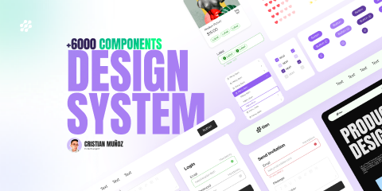

# Design System _ UI kit _ +6000 Components (Community)

**Source:** Figma file `iPaRhsDyCv9dPJKmKX3o4z`
**Captured:** 2026-05-19
**Priority:** skip
**Status:** stub — not yet absorbed

## Pages (24)

- `301:8700` — Cover _(3 top-level frames)_
- `89:4175` — ----- Foundations -----  _(0 top-level frames)_
- `103:4171` — Layout Grid _(3 top-level frames)_
- `58:1461` — Icons _(6 top-level frames)_
- `0:1` — Colors and Shadows _(3 top-level frames)_
- `1:736` — Fonts _(1 top-level frames)_
- `1:735` — Typography _(1 top-level frames)_
- `7:2` — Identificadores _(3 top-level frames)_
- `35:9` — Patterns and Decoration _(3 top-level frames)_
- `1:737` — ----- Atoms ----- _(0 top-level frames)_
- `57:1419` — Buttons _(1 top-level frames)_
- `89:4176` — Tag _(1 top-level frames)_
- `131:4229` — Inputs _(3 top-level frames)_
- `131:4230` — Switch _(1 top-level frames)_
- `131:4374` — Text Area _(1 top-level frames)_
- `131:4231` — Dropdown _(1 top-level frames)_
- `131:4232` — Rating _(1 top-level frames)_
- `236:8234` — Checkbox _(1 top-level frames)_
- `131:4233` — Menu _(2 top-level frames)_
- `1:738` — ----- Molecules -----  _(0 top-level frames)_
- `35:3` — Navigation Bars _(1 top-level frames)_
- `131:4235` — Cards _(6 top-level frames)_
- `136:4294` — ----- Organisms -----  _(0 top-level frames)_
- `136:4374` — Hero _(7 top-level frames)_

## Skip

_TBD_

## Absorb

_TBD_

## Tension

_TBD_

## Decisions

_None yet._

## Open follow-ups

- Render previews of priority pages and write per-page NOTES.md
