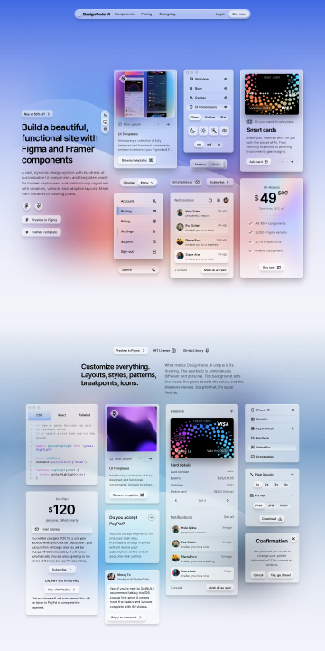

# DesignCode UI - Figma Design UI Kit & Design System (Community)

**Source:** Figma file `Qjl8Ex80dXkdVOEHsB4vYU`
**Captured:** 2026-05-19
**Priority:** skip
**Status:** stub — not yet absorbed

## Pages (32)

- `0:1` — DesignCode UI                         _(3 top-level frames)_
- `256:12275` — Colors _(12 top-level frames)_
- `345:664359` — Spacing _(12 top-level frames)_
- `317:35652` — Shadows and Blur _(8 top-level frames)_
- `104:6331` — Typography & Content _(11 top-level frames)_
- `344:519814` — Buttons _(4 top-level frames)_
- `344:519826` — Menus _(3 top-level frames)_
- `344:519819` — Cards _(5 top-level frames)_
- `243:26724` — Icons _(11 top-level frames)_
- `7029:30001` — Wireframes _(3 top-level frames)_
- `228:24510` — Backgrounds _(7 top-level frames)_
- `251:38964` — Patterns _(4 top-level frames)_
- `225:13802` — –– Templates _(0 top-level frames)_
- `312:22948` —     Template: UI Kit 🔒 (Preview) _(6 top-level frames)_
- `222:14627` —     Template: Mockups 🔒 (Preview) _(2 top-level frames)_
- `2420:838279` —     Template: Courses 🔒 (Preview) _(11 top-level frames)_
- `2420:849991` —     Template: Booking 🔒 (Preview) _(1 top-level frames)_
- `6773:42988` —     Template: Framer Course 🔒 (Preview) _(6 top-level frames)_
- `2420:846424` —     Template: Video Streaming 🔒 (Preview) _(7 top-level frames)_
- `222:17131` —     Template: App Showcase 🔒 (Preview) _(2 top-level frames)_
- `5706:54990` —     Template: AI Apps 🔒 (Preview) _(24 top-level frames)_
- `222:11008` —     Template: Icons 🔒 (Preview) _(1 top-level frames)_
- `225:14286` — –– Sections _(0 top-level frames)_
- `224:12831` —     Section: Hero 🔒 (Preview) _(9 top-level frames)_
- `318:42345` —     Section: Features 🔒 (Preview) _(13 top-level frames)_
- `224:14239` —     Section: Pricing 🔒 (Preview) _(6 top-level frames)_
- `4219:24725` —     Section: Changelog 🔒 (Preview) _(5 top-level frames)_
- `204:32979` —     Section: Footers 🔒 (Preview) _(2 top-level frames)_
- `368:723985` —     Section: Browse 🔒 (Preview) _(3 top-level frames)_
- `224:11291` —     Section: Testimonials 🔒 (Preview) _(2 top-level frames)_
- `368:723984` —     Section: FAQ (Preview) 🔒 (Preview) _(2 top-level frames)_
- `318:39473` — Thumbnail _(1 top-level frames)_

## Skip

_TBD_

## Absorb

_TBD_

## Tension

_TBD_

## Decisions

_None yet._

## Open follow-ups

- Render previews of priority pages and write per-page NOTES.md
