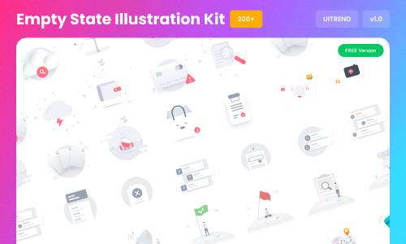

# Empty State Illustration Kit (Community)

**Source:** Figma file `AESmgjarRInZUMRY7ThLb0`
**Captured:** 2026-05-19
**Absorbed:** 2026-05-21
**Priority:** medium → **demote to skip on review**
**Status:** absorbed — 0 changes; documents the deliberate "no
decorative illustration" choice for TuxEmptyState

## What it is

A 200+ illustration set marketed as "FREE Version v1.0" with
saturated-gradient cartoony characters dropped into iPhone-mockup
backgrounds. Pages confirm the framing: 14 frames on the main page
(13 of them labeled `iPhone 13 mini - N`, no scenario semantics) +
13 more in "More Examples."

## Pages (4)

- `71:17946` — Thumbnail _(1 frame)_
- `0:1` — EMPTY STATE ILLUSTRATION _(14 frames, mostly iPhone mockups)_
- `70:12473` — More Examples _(13 frames, same template)_
- `67:13366` — Components _(7 frames, illustration atoms)_

## Skip

Effectively the entire file. Reasons:

- **Visual character mismatch.** TUX is editorial / research-
  publishing — paper grain, maroon signature rule, restrained color,
  Work Sans + Oswald. Saturated-gradient cartoon illustrations are
  consumer-SaaS chrome that would actively damage TUX identity.
- **TTI uses real photography**, not illustrations, when an empty
  state needs warmth (see palette.md). The default empty state in
  TUX is a Lucide icon + heading + body + optional CTA. That's the
  correct restraint level.
- **Frames are mobile-mockup driven** (iPhone 13 mini variants),
  not raw illustration assets. Even if we wanted illustrations, the
  delivery format is wrong.
- **No scenario taxonomy.** The frames are not named by use case
  (e.g. "search-no-results", "empty-cart") — they're named by
  device. Nothing to extract about *when* to show an empty state.

## Absorb

Nothing **from the kit itself**. But the encounter is a useful
checkpoint:

1. **Reaffirm TuxEmptyState's preset library.** Our `kind` props
   (`no-data` / `no-results` / `not-found` / `no-permissions` /
   `first-run`) is the right taxonomy — built from real scenarios,
   not 200 generic illustrations. The Backstage absorption pass
   already shipped this. No drift.
2. **Document the deliberate "no decorative illustration" choice**
   somewhere a future contributor will see it. Currently the
   `kind`-preset showcase implies it but doesn't name it. Add a
   one-line callout to `TuxEmptyState`'s JSDoc and/or
   `design/components.md` "Conventions" section when we next touch
   them: *"Decorative illustrations are deliberately avoided.
   Empty states use a Lucide icon + heading + body + optional CTA.
   For warmth, use a real photograph via TuxPhotoCard, not a
   stylized illustration."*

## Tension

- **Modern SaaS expects illustrations in empty states.** People
  trained on Dropbox / Notion / Slack expect a friendly cartoon.
  TUX deliberately resists this — research-publishing identity
  outweighs the "consumer SaaS expectation." This is a stance, not
  an oversight.

## Decisions

- **Skip the kit.** Demote from "medium-signal" to "skip" — keep
  in INDEX for reference, do not deep-dive further.
- **Document the design stance** as the one carry-forward (see
  Open follow-ups). One sentence in `TuxEmptyState`'s JSDoc and a
  matching line in `design/components.md` Conventions.

## Open follow-ups

- One-line callout in `TuxEmptyState` JSDoc + `design/components.md`
  Conventions section: empty states deliberately avoid decorative
  illustrations. Use Lucide icons; warmth via real photography
  (`TuxPhotoCard`), not stylized illustration.
- Consider re-bucketing this file as "skip" in INDEX.md priority
  matrix on the next rebuild (already de-prioritized in this
  NOTES; no code change needed unless we add a "demoted from
  medium" tag).
