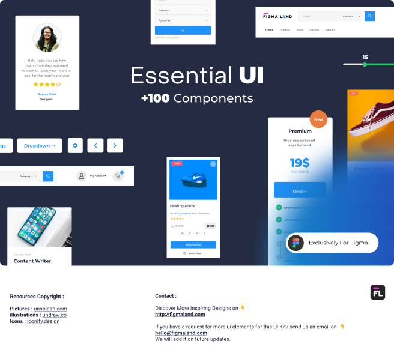

# Essential UI - Figma Ui Kit (Community)

**Source:** Figma file `E1Gq6nCnUVtnLA6yHegX9j`
**Captured:** 2026-05-19
**Priority:** skip
**Status:** stub — not yet absorbed

## Pages (3)

- `69:5241` — 😃 INDEX _(1 top-level frames)_
- `315:449` —  __ Components _(20 top-level frames)_
- `287:0` — ✍ Workshop _(0 top-level frames)_

## Skip

_TBD_

## Absorb

_TBD_

## Tension

_TBD_

## Decisions

_None yet._

## Open follow-ups

- Render previews of priority pages and write per-page NOTES.md
