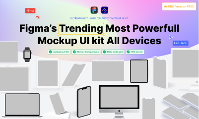

# Figma’s Trending Most Powerfull Mockup UI Kit Minimal Devices (Zara) (Community)

**Source:** Figma file `x2OQLr4XLt52HOAr3KMkzM`
**Captured:** 2026-05-19
**Priority:** skip
**Status:** stub — not yet absorbed

## Pages (16)

- `45:2015` — Thumbnail _(5 top-level frames)_
- `45:2016` — ----Mockups---- _(0 top-level frames)_
- `0:1` —       ★ Get Started _(12 top-level frames)_
- `28:304` —       ★ Mix Mockups _(10 top-level frames)_
- `28:303` —       ★ Clay Mockups _(34 top-level frames)_
- `36:1471` — ----DEVICES---- _(3 top-level frames)_
- `2:247` —       ↳ iPhone _(18 top-level frames)_
- `3:5614` —       ↳ iPad _(6 top-level frames)_
- `3:5613` —       ↳ Apple Watch _(6 top-level frames)_
- `3:6990` —       ↳ Mac Book _(3 top-level frames)_
- `4:9160` —       ↳ Mac Book, Light-Dark _(4 top-level frames)_
- `3:7348` —       ↳ iMac _(3 top-level frames)_
- `3:7457` —       ↳ Google Pixel 3 _(6 top-level frames)_
- `3:8019` —       ↳ Samsung _(6 top-level frames)_
- `45:2017` — ----Examples---- _(0 top-level frames)_
- `28:504` —       ✨ 3D Mockups _(5 top-level frames)_

## Skip

_TBD_

## Absorb

_TBD_

## Tension

_TBD_

## Decisions

_None yet._

## Open follow-ups

- Render previews of priority pages and write per-page NOTES.md
