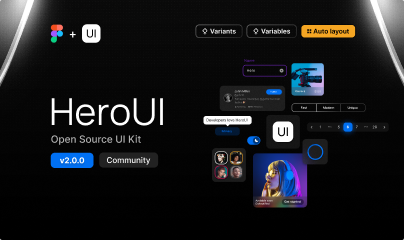

# HeroUI Figma Kit (Community) (Community)

**Source:** Figma file `1BFdRXkhHLfg7jttL1XMzy`
**Captured:** 2026-05-19
**Priority:** skip
**Status:** stub — not yet absorbed

## Pages (38)

- `0:1` — Welcome _(3 top-level frames)_
- `5:1194` — Theme _(24 top-level frames)_
- `3:13` — ___________   Components  ___________ _(0 top-level frames)_
- `992:4194` — Accordion _(2 top-level frames)_
- `3125:210` — Alert _(2 top-level frames)_
- `489:17650` — Avatar _(2 top-level frames)_
- `2545:33395` — Avatar Group _(2 top-level frames)_
- `696:52331` — Badge _(2 top-level frames)_
- `3:14` — Button _(2 top-level frames)_
- `22:6236` — ButtonGroup _(2 top-level frames)_
- `4208:222` — Calendar _(2 top-level frames)_
- `3333:1640` — Card _(3 top-level frames)_
- `3568:423` — Carousel _(2 top-level frames)_
- `636:299` — Checkbox _(2 top-level frames)_
- `673:6159` — Checkbox Group _(2 top-level frames)_
- `3:24` — Chip _(2 top-level frames)_
- `3:31` — Code _(2 top-level frames)_
- `2584:48` — Divider _(2 top-level frames)_
- `3:34` — Input _(2 top-level frames)_
- `519:25377` — Kbd _(2 top-level frames)_
- `3:36` — Link _(2 top-level frames)_
- `3606:776` — Number Input _(2 top-level frames)_
- `1573:1538` — Progress _(2 top-level frames)_
- `3:23` — Radio _(2 top-level frames)_
- `1364:174` — Select _(2 top-level frames)_
- `1118:8` — Slider _(2 top-level frames)_
- `2411:8712` — Spinner _(2 top-level frames)_
- `3:33` — Switch _(2 top-level frames)_
- `515:15` — Table _(2 top-level frames)_
- `1356:1128` — Tabs _(3 top-level frames)_
- `740:18259` — Tooltip _(2 top-level frames)_
- `691:4394` — User _(3 top-level frames)_
- `3592:214` — Toast _(2 top-level frames)_
- `3369:214` — Input OTP _(2 top-level frames)_
- `19:6215` — _____________ Misc _____________ _(0 top-level frames)_
- `5:3550` — Figma Components _(11 top-level frames)_
- `19:6214` — Brand _(7 top-level frames)_
- `10:1849` — Icons _(232 top-level frames)_

## Skip

_TBD_

## Absorb

_TBD_

## Tension

_TBD_

## Decisions

_None yet._

## Open follow-ups

- Render previews of priority pages and write per-page NOTES.md
