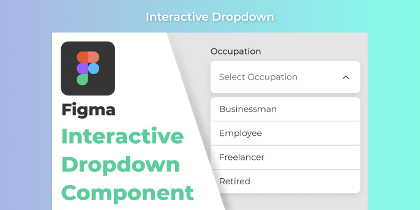

# Interactive Dropdown (Community) (1)

**Source:** Figma file `71ZUsoYgXkg3L1vA6U60K0`
**Captured:** 2026-05-19
**Absorbed:** 2026-05-22 — by reference (duplicate)
**Priority:** medium → skip (duplicate)
**Status:** absorbed — duplicate of sibling file

## Duplicate of [`../interactive-dropdown/`](../interactive-dropdown/NOTES.md)

Same author, same 2-page structure (Thumbnail + ListBox), same 9
frame variants of the Occupation dropdown. The Figma project
listing accidentally cached the file twice with different keys
(`BBRfDY5aAHIAc9yYag87nJ` and `71ZUsoYgXkg3L1vA6U60K0`).

See the canonical record at
[`../interactive-dropdown/NOTES.md`](../interactive-dropdown/NOTES.md)
for the full audit + decisions.

**TL;DR:** No new TUX component. `USelectMenu` already covers it;
the only worthwhile follow-up is a future `TuxField` (label + help
+ input cluster) that has nothing specifically to do with this file.
