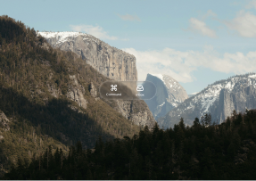

# iOS 26 Liquid Glass (Community)

**Source:** Figma file `hyEON2VLGEZ5nRsdJTk0zJ`
**Captured:** 2026-05-19
**Priority:** skip
**Status:** stub — not yet absorbed

## Pages (1)

- `0:1` — Liquid Glass Recreated _(2 top-level frames)_

## Skip

_TBD_

## Absorb

_TBD_

## Tension

_TBD_

## Decisions

_None yet._

## Open follow-ups

- Render previews of priority pages and write per-page NOTES.md
