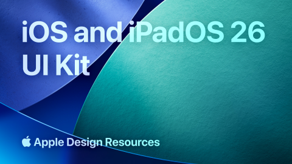

# iOS and iPadOS 26 (Community)

**Source:** Figma file `Wll4TMrvMMxTU2juLOWtoC`
**Captured:** 2026-05-19
**Absorbed:** 2026-05-22 (platform-aware lens)
**Priority:** medium (re-bucketed from skip)
**Status:** absorbed — 0 new components; doctrine inputs for Tauri-on-iOS (future)



> Grounded by [`design/platform-awareness.md`](../../design/platform-awareness.md).
> The full Apple Design Resources iOS / iPadOS 26 UI Kit. 45 pages;
> relevant for **future Tauri Mobile on iOS** targets only — no
> current TTI consumer ships to iOS, so this is groundwork.

## What it is

Apple's official **iOS 26 / iPadOS 26** UI Kit. 45 pages spanning
every native control + system surface. Same Liquid Glass material
as macOS Tahoe, but applied to touch-first surfaces (tab bars,
sheets, action sheets, sidebars, segmented controls, safe areas).

## Pages (45)

Selected highlights:

- `0:1746` — Colors _(6 frames — iOS system colors)_
- `215:105157` — **Materials** _(21 frames — Liquid Glass tiers on
  iOS)_
- `0:2194` — **Text Styles and Dynamic Type** _(4 frames —
  Apple's "Dynamic Type" accessibility scale)_
- `507:24672` — Product Bezels _(12 frames — iPhone/iPad mockup
  frames, skip)_
- `507:24668` — Alerts _(5 frames — iOS-native alert dialog)_
- `507:24669` — **Action Sheets** _(2 frames — bottom-anchored
  action menu)_
- `507:24670` — **Activity Views** _(10 frames — iOS share sheet)_
- `507:24673` — Buttons _(12 frames — iOS button variants)_
- `507:24675` — **Lists** _(17 frames — iOS list idioms incl.
  grouped, plain, sidebar)_
- `507:24678` — **Notifications** _(2 frames — iOS notification
  banner)_
- `507:24684` — **Sheets** _(2 frames — iOS modal sheets w/ drag
  handle)_
- `507:26013` — Sidebars _(11 frames — iPad sidebar idiom)_
- `507:24686` — **Status Bars and Menu Bars** _(5 frames — top
  strip w/ time + signal + battery)_
- `507:24687` — Steppers _(6 frames)_
- `507:24689` — **Tab Bars** _(7 frames — bottom-anchored 3-5 item
  nav)_
- `507:25993` — Toolbars _(24 frames)_
- `5413:10149` — **Windows** _(4 frames — safe areas for notch /
  home indicator / dynamic island)_

## Pattern → TUX-on-Tauri-iOS mapping (future)

| iOS surface | TUX-on-Tauri-iOS behavior | Implementation hook |
|---|---|---|
| **Safe areas** (notch + home indicator + dynamic island) | CSS `env(safe-area-inset-*)` in layouts; meta viewport `viewport-fit=cover` | sidebar.vue + default.vue updates |
| **Tab Bars** (bottom 3-5 items) | A `TuxTabBar` (different from `TuxTabs`!) anchored bottom; respect home-indicator inset | Future component; defer until iOS target |
| **Action Sheets** (bottom-anchored menu) | A `USlideover` with `position="bottom"` + iOS-styled height | Composition; no new component |
| **iOS share sheet** | Use Tauri `share` plugin / `navigator.share` Web API for handoff to native sheet | `TuxArtifact` share action enhancement |
| **Sheets with drag handle** | `TuxModal` mobile variant: bottom-anchored, drag-handle pill at top, can be dragged to dismiss | `TuxModal` mobile variant |
| **Dynamic Type** | Honor `font-size: 100%` from system; use `rem` everywhere (TUX already does); larger text scales the whole UI | No change — TUX already uses `rem` |
| **Status bar** | Tauri controls visibility (light/dark icons); no Vue work | Tauri config |
| iOS buttons | TuxButton; allow `--radius-pill` variant for full-pill iOS look on `[data-platform="ios"]` | Optional variant |
| List idioms (grouped, plain, sidebar) | `TuxLinkList` covers most; iOS-grouped (banded sections) is a `TuxList` variant | Future enhancement |

## Skip

- **Wholesale adoption of Liquid Glass.** Same as iOS 26 Liquid
  Glass absorption: constrained-use only.
- **iOS button pill shape as the TUX default.** Stays an optional
  `[data-platform="ios"]` variant; default radius stays
  `--radius-md`.
- **iOS-native icon set (SF Symbols).** TUX stays on Heroicons.
  Document this in the `template-for-sf-symbol-creator` absorption.
- **The product bezels (iPhone/iPad mockup frames).** Marketing
  artifacts; not TUX.
- **Activity Views as a full mock.** We hand off to the native
  share sheet via `navigator.share` or Tauri's `share` plugin.
- **Face ID auth flow.** Not in TTI consumer surfaces.

## Absorb

1. **Safe-area handling is foundational.** Even before a real iOS
   target, TUX layouts should honor `env(safe-area-inset-top)`
   etc. so the future move is just turning it on. Today:
   ```css
   /* default.vue */
   padding-top: env(safe-area-inset-top);
   padding-bottom: env(safe-area-inset-bottom);
   padding-inline: env(safe-area-inset-left)
                  env(safe-area-inset-right);
   ```
   Cost is zero on non-iOS (envs evaluate to 0). **Apply when
   touching layouts next**.

2. **Bottom-tab nav idiom.** iOS / Android favor bottom nav (3-5
   icons). When TUX ships Tauri Mobile, the sidebar.vue layout
   collapses on mobile to a default top header + bottom
   `TuxTabBar`. Reference the [50-mobile-bottom-navigation-bar
   absorption](../50-mobile-bottom-navigation-bar/NOTES.md) for the
   canonical 3-5 item geometry.

3. **Sheet-with-drag-handle modal pattern.** When `TuxModal`
   ships a mobile variant, source the geometry from this file's
   `507:24684` (Sheets). 28px drag-handle pill, ~16px rounded top
   corners, full-width.

4. **Dynamic Type respect.** TUX already uses `rem` for all sizes
   — Dynamic Type works automatically. **No change needed**, but
   ensure no contributor regresses by hardcoding `px` sizes.

5. **iOS action sheet as composition, not new component.**
   `USlideover position="bottom"` + a list of buttons is the
   shape. The pattern note belongs in `design/components.md`
   Conventions when a TTI mobile surface appears.

## Tension

- **"iOS users expect everything to look iOS-native."** True for
  Apple-first apps; less true for cross-platform research tools.
  TUX brand wins for surfaces (charts, dashboards); iOS idioms win
  for navigation patterns (tabs, sheets, action sheets) and safe
  areas. The split mirrors the macOS one.
- **Tab bar vs sidebar.** iPhone uses bottom tab bar; iPad uses
  sidebar (same as desktop). At iPad size, sidebar.vue can stay;
  at iPhone size, switch to TuxTabBar. Container-query trigger,
  not viewport.

## Decisions

- **No new components today.** Defer `TuxTabBar`, `TuxModal`
  mobile variant, `TuxList` (iOS grouped) until Tauri Mobile-iOS
  becomes real.
- **Safe-area CSS** is the only no-regret change available now —
  apply when touching layouts next pass.
- **Move file from skip → medium** in priority sets.
- **No SF Symbols adoption** — Heroicons stays.

## Open follow-ups

- Apply `env(safe-area-inset-*)` to `app/layouts/default.vue` +
  `app/layouts/sidebar.vue` next time those files are touched.
  No-regret, zero cost on non-iOS.
- When Tauri Mobile lands, source `TuxTabBar` geometry from
  `507:24689` and `TuxModal` mobile variant from `507:24684`.
- Document iOS action-sheet composition pattern in
  `design/components.md` Conventions when first consumer appears.
