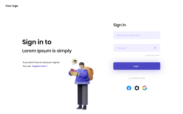

# LOGIFY - WEB LOGIN UI KIT (Community)

**Source:** Figma file `dIlHjYXvFZjIyHpsBCu2NE`
**Captured:** 2026-05-19
**Priority:** skip
**Status:** stub — not yet absorbed

## Pages (2)

- `0:1` — Screens _(40 top-level frames)_
- `653:495` — Thunmb _(1 top-level frames)_

## Skip

_TBD_

## Absorb

_TBD_

## Tension

_TBD_

## Decisions

_None yet._

## Open follow-ups

- Render previews of priority pages and write per-page NOTES.md
