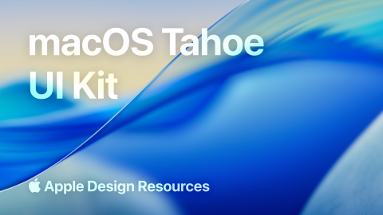

# macOS 26 (macOS Tahoe) UI Kit (Community)

**Source:** Figma file `mk4HBYB6nEapDvp7HjpgnD`
**Captured:** 2026-05-19
**Absorbed:** 2026-05-22 (platform-aware lens for Tauri target)
**Priority:** medium (re-bucketed from skip)
**Status:** absorbed — 0 new components; doctrine inputs for Tauri-on-macOS



> Grounded by [`design/platform-awareness.md`](../../design/platform-awareness.md).
> The most relevant platform-kit file for TUX-on-Tauri-desktop —
> macOS is the daily-driver host for many TTI researchers.

## What it is

Apple's official **macOS Tahoe (macOS 26)** UI Kit from Apple Design
Resources. 42 pages spanning the **Liquid Glass** visual language,
every standard control, native chrome (traffic lights, sheets,
sidebars, toolbars), and system materials.

This is the canonical reference for what TUX-on-Tauri-Mac should
*feel like* in its window. We don't adopt the visual language —
TUX paper-grain wins — but every chrome decision lives here.

## Pages (42)

Selected highlights:

- `121:18094` — **Examples** _(15 frames — real-app composites
  showing chrome + content layered)_
- `0:687` — **Colors** _(6 frames — system colors, accent variants)_
- `483:8848` — **Materials** _(11 frames — Liquid Glass tiers:
  Regular / Thick / Thin / Chrome materials)_
- `0:962` — Text Styles _(5 frames — San Francisco type ramp)_
- `207:14501` — **Toolbars and Titlebars** _(2 frames — traffic
  lights placement, drag regions, toolbar items)_
- `207:14504` — **Windows** _(5 frames — window-frame variants)_
- `207:14493` — **Sheets** _(2 frames — modal sheets sliding from
  titlebar)_
- `207:14495` — Sidebars _(2 frames — translucent sidebar idiom)_
- `497:6467` — **Scrollbar** _(3 frames — overlay scrollbar
  geometry)_
- `207:14475` — **Menu Bar and Dock** _(2 frames — top-of-screen
  menu strip; system-wide)_
- `207:14490` — Dialogs _(2 frames — alert + confirmation)_
- `207:14483` — Popovers _(2 frames — anchored popover with
  triangle pointer)_
- `207:14497` — Steppers _(3 frames — number stepper control)_

## Pattern → TUX-on-Tauri-Mac mapping

| macOS surface | TUX-on-Tauri-Mac behavior | Implementation hook |
|---|---|---|
| **Traffic lights** (close/min/zoom, top-left) | Render in `TuxAppFrame` left slot; respect Apple's 12px diameter, 8px gaps, 14px from window edge | Tauri's `set_decorations(false)` + custom; or Tauri's `traffic-light` plugin |
| **Title-as-toolbar** (no separate titlebar) | `TuxAppFrame` collapses titlebar + toolbar into one strip ~52px tall; brand title centered or left of toolbar items | `[data-platform="mac"]` style |
| Drag region | Entire title strip except traffic lights | `data-tauri-drag-region` on strip |
| **Overlay scrollbar (auto-hide)** | Apply via `[data-platform="mac"] ::-webkit-scrollbar { width: 0; }` + reveal on hover via scroll events | Future `tux-scrollbar` utility |
| **San Francisco font** | `--font-system: -apple-system, "SF Pro", BlinkMacSystemFont` on `[data-platform="mac"]` | tokens.css |
| ⌘ modifier | `TuxKbd` Mac path already correct | No change |
| **Sheet animation** (slides from titlebar) | TUX modals on Mac get a slide-from-top animation; sheet attaches to titlebar visually | `TuxModal` Mac variant; respect `prefers-reduced-motion` |
| **Sidebar translucency** | sidebar.vue on Mac can opt into Liquid Glass *only* if surrounding chrome already uses it; default stays paper | Opt-in via `glass` prop on sidebar.vue |
| Native menu bar | System menu strip at top of screen; defined in Tauri Rust config | NOT a Vue component; Rust side |
| System accent | Read via Tauri or `accent-color` CSS; appears in chrome focus rings only | `--focus-ring-system` |
| **Liquid Glass material** | **Don't adopt as TUX-wide surface**. Allowed: titlebar tint, maybe popover backdrop. Surfaces stay paper | Constrained-use only |

## Skip

- **Liquid Glass as a TUX surface material.** It's striking but
  fundamentally conflicts with TUX paper-grain. We allow it on the
  titlebar strip and optionally on popover backdrops; everywhere
  else surfaces stay opaque paper.
- **San Francisco as the TUX brand font.** Brand stays Maroon Sans
  + Inter; system font is for chrome-only surfaces inside
  `TuxAppFrame`.
- **macOS color palette wholesale.** System red / green / yellow
  appear only on traffic lights; everywhere else `--chart-*` and
  brand maroon win.
- **Disclosure controls / color wells / image wells / sliders
  & dials.** Niche macOS controls; not on the TUX roadmap.
- **Steppers as a control widget.** TUX has `UInputNumber`
  (Reka/Nuxt UI) for the same semantics; don't add a macOS-style
  arrow-pair stepper.

## Absorb

1. **Title-toolbar unification.** Modern macOS apps collapse the
   titlebar into the toolbar (Tahoe enforces this). `TuxAppFrame`
   on Mac renders one ~52px strip with traffic lights (left), an
   optional brand title (center or just-right-of-lights), and
   toolbar items (right). On Win/Linux, titlebar and toolbar can
   stay distinct.

2. **Sheet animation primitive.** macOS modals slide down from the
   titlebar (the "sheet" idiom). When `TuxModal` runs on
   `[data-platform="mac"]`, swap the default `scale + fade` for a
   `translateY(-100%) → 0` slide. Respect `prefers-reduced-motion`.

3. **Overlay scrollbar geometry.** Mac scrollbars auto-hide and
   only appear on scroll. Approximate via:
   ```css
   [data-platform="mac"] *::-webkit-scrollbar { width: 0; }
   [data-platform="mac"] *:hover::-webkit-scrollbar { width: 8px; }
   ```
   Detailed spec lives in
   [`scrollbar-kit-macos-windows`](../scrollbar-kit-macos-windows/NOTES.md).

4. **Liquid Glass material — constrained use.** Tahoe's hero
   visual is refractive glass. We allow Glass **only** on:
   - `TuxAppFrame` titlebar strip (optional)
   - `TuxPopover` / `TuxTooltip` backdrop (optional, behind text)

   We disallow Glass on `TuxCard` / `TuxCallout` / `TuxAlert` /
   chart frames / dashboard tiles — those are paper. Document
   this in the future `TuxAppFrame` JSDoc.

5. **No fake top-bar menu.** macOS users expect the system menu
   strip at the very top of the screen. **Never render `TuxMenuBar`
   on `[data-platform="mac"]`** — it would visually conflict and
   feel wrong. Tauri Rust config owns the menu on Mac.

## Tension

- **"Adopt Liquid Glass for visual freshness" temptation.** Resist.
  TTI research-publishing wants editorial gravitas, not
  consumer-OS glamour. Glass is constrained-use only.
- **Sheet animations vs reduced-motion.** Always honor
  `prefers-reduced-motion: reduce` — sheet animation collapses to
  instant on/off.
- **System font for everything.** Pulling Apple users in could
  tempt swapping body text to SF. Don't — TUX type identity is
  Maroon Sans + Inter; SF appears only in chrome surfaces.

## Decisions

- **No new components today.** All chrome behavior deferred to
  `TuxAppFrame`, `TuxMenuBar` (Win/Linux only), `tux-scrollbar`,
  `TuxModal` Mac-sheet animation.
- **Liquid Glass: constrained adoption only** (titlebar + popover
  backdrop). Document on every relevant component.
- **Move file from skip → medium** in priority sets.
- **Reaffirm "no fake menu bar on Mac"** as a `TuxMenuBar`
  precondition.

## Open follow-ups

- When `TuxAppFrame` ships, the Mac reference frames are
  `207:14501` (Toolbars + Titlebars) and `207:14504` (Windows).
  Recreate traffic-light geometry from those.
- When `TuxModal` gets platform-aware animation, source the macOS
  sheet motion from `207:14493` (Sheets).
- Defer Liquid Glass material implementation until `TuxAppFrame`
  needs the titlebar tint. CSS `backdrop-filter` is the primitive.
