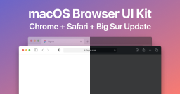

# macOS Browser UI Kit (Big Sur Update) (Community)

**Source:** Figma file `DZzvUrouPRLAL52WCgJl3o`
**Captured:** 2026-05-19
**Absorbed:** 2026-05-22 (platform-aware lens)
**Priority:** medium (re-bucketed from skip)
**Status:** absorbed — no new components; reference for browser-chrome mockups

> Grounded by [`design/platform-awareness.md`](../../design/platform-awareness.md).
> Three-page reference for **macOS Chrome and Safari** window
> chrome in the Big Sur / modern macOS era.

## What it is

A small reference kit showing **Chrome and Safari** windows on macOS,
plus a "File Thumbnail" page. Useful for marketing mockups that
need to show the Landscape web app inside a macOS browser frame —
not relevant for building TUX components themselves.

## Pages (3)

- `0:1` — **Browsers** _(9 frames — Chrome + Safari in light/dark,
  several heights)_
- `1008:150` — Components _(13 frames — tab strip, URL bar, panel
  controls)_
- `961:143` — File Thumbnail _(1 frame — macOS file icon, skip)_

## Pattern → TUX-on-Tauri-Mac mapping

For Tauri-Mac apps we draw **our own titlebar** via `TuxAppFrame`;
we don't host a URL bar or a tab strip the way Chrome/Safari do.
So this file's content mostly doesn't apply.

The one relevant takeaway: **when TUX is consumed in a browser
(plain web, not Tauri)**, the surrounding URL bar + tab strip
belongs to the browser — TUX content sits below. We don't try to
unify the chrome.

## Skip

- **The whole content kit.** TUX-on-Tauri-Mac draws its own
  titlebar via `TuxAppFrame` (see [macos-26 NOTES](../macos-26/NOTES.md)).
  Chrome/Safari chrome is irrelevant for our Tauri target.
- **The browser frame as marketing chrome.** If a designer needs to
  show Landscape in a Chrome mockup for an external presentation,
  this file's frames are handy — but that's a marketing artifact,
  not TUX-source material.

## Absorb

1. **One small confirmation:** macOS browsers (Chrome / Safari /
   Firefox) all anchor traffic lights top-left at the same
   geometry Apple Design Resources specs (12px diameter, 8px
   gaps, 14px from edge). `TuxAppFrame` Mac variant uses the same
   spec — sourced from [macos-26](../macos-26/NOTES.md) §`207:14501`,
   not from this file.

## Tension

- **None.** File is reference-only.

## Decisions

- **No new components.**
- **No doctrine changes.** macOS chrome geometry is already
  captured in `macos-26/NOTES.md` from a more authoritative source.
- **Move file from skip → medium** for taxonomic consistency with
  other Mac files; in practice it's still skip-tier.

## Open follow-ups

- If a marketing designer asks for "show Landscape in a Chrome
  window for a slide," reference this file's frames. Not a TUX
  surface; a marketing-asset surface.
