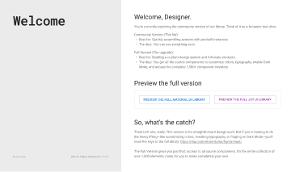

# Material UI for Figma (and MUI X) (Community) (1)

**Source:** Figma file `MKII2vdiNlk0YeDWC27ErO`
**Captured:** 2026-05-19
**Absorbed:** 2026-05-22 — by reference (duplicate)
**Priority:** skip
**Status:** absorbed — duplicate of sibling file

## Duplicate of [`../material-ui-for-figma-and-mui-x/`](../material-ui-for-figma-and-mui-x/NOTES.md)

The Figma project listing accidentally cached the MUI Figma
library twice with different file keys (`okkZzLjRiczR8YfafHjbcX`
and `MKII2vdiNlk0YeDWC27ErO`). Same content, 70 pages each.

See the canonical record at
[`../material-ui-for-figma-and-mui-x/NOTES.md`](../material-ui-for-figma-and-mui-x/NOTES.md)
for the full audit + decisions.

**TL;DR:** Framework mismatch (MUI is React-only; TUX is Vue +
Nuxt UI 4 on Reka). Material 3 absorption already covered the
relevant cross-platform ground.
