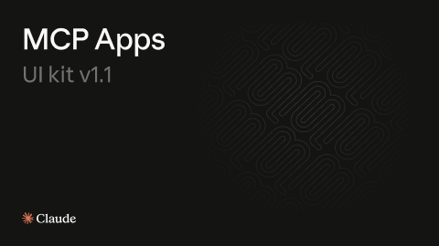

# MCP Apps for Claude (Community)

**Source:** Figma file `ElAkut7BJMOJTUnD5LGi2z`
**Captured:** 2026-05-19
**Priority:** medium
**Status:** stub — not yet absorbed

## Pages (17)

- `0:1` — 🖼️ Cover _(1 top-level frames)_
- `467:14766` — --- _(0 top-level frames)_
- `467:20291` — Foundations _(0 top-level frames)_
- `467:20292` — 🖌️ Color _(1 top-level frames)_
- `7:19` — 🔠 Typography _(1 top-level frames)_
- `467:21770` — 📐 Layout _(1 top-level frames)_
- `467:21815` — 🖋️ Icons _(2 top-level frames)_
- `467:23749` — --- _(0 top-level frames)_
- `467:23750` — Displays _(0 top-level frames)_
- `467:24634` — ⬜️ Inline card _(3 top-level frames)_
- `467:31022` — 🎠 Inline carousel _(3 top-level frames)_
- `467:35319` — ↔ Full screen _(2 top-level frames)_
- `467:23752` — --- _(0 top-level frames)_
- `467:23751` — Claude Components _(3 top-level frames)_
- `7:20` — 🖥️ Desktop web components _(3 top-level frames)_
- `455:241691` — 📱 Mobile components _(4 top-level frames)_
- `838:2412` — 📣 Promotional assets _(2 top-level frames)_

## Skip

_TBD_

## Absorb

_TBD_

## Tension

_TBD_

## Decisions

_None yet._

## Open follow-ups

- Render previews of priority pages and write per-page NOTES.md
