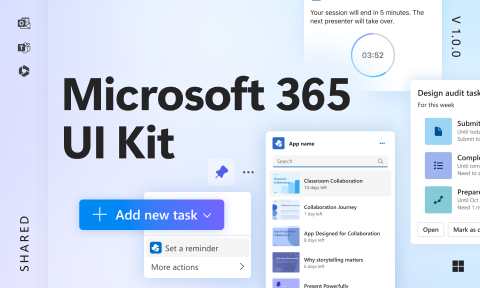

# Microsoft 365 UI Kit (Community)

**Source:** Figma file `qqe9q3vo0AcdBQ3wnxuJku`
**Captured:** 2026-05-19
**Absorbed:** 2026-05-22
**Priority:** medium
**Status:** absorbed — no new components

## What it is

Not "Microsoft 365 the design system" — it's the **app-extension SDK
spec**: how third-party developers build apps that live inside M365
host surfaces (Teams sidebar, Outlook tabs, Word add-ins, etc.).

The cover gives it away: "Add new task" button with reminder dropdown,
session-ending notification, app launcher panel — all surfaces an
extension lives **inside**, not standalone product chrome.

25 pages spanning:
- **App capabilities** (Personal apps · Tabs · Message extensions ·
  Meeting extensions · Bots · Add-ins — six host slots an extension
  can plug into)
- **Sample app templates** (12 reference compositions)
- **UI components for app creation** (9 frames)
- **App submission** (icon spec, store assets)
- **Base host screens** (20 frames of "what the surrounding M365 chrome
  looks like" — drawn so designers know the box their app sits in)
- **Subcomponents** (342 frames — atom catalog)

## Pages (25)

Selected highlights (full list in stub above):
- `82:526621` — **App capabilities** umbrella
- `160:236405..408`, `1406:526859`, `451:62260` — six host-slot specs
- `2178:511983` — **Templates** (12 sample app compositions)
- `315:492195` — **App-creation specific components** (9 frames)
- `1709:221559` — **Base host screens** (20 frames of M365 chrome)
- `55:527573` — **Subcomponents** (342 frames)

## Skip

- **The entire app-extension framing.** TUX builds **standalone web
  apps** (Landscape, tti-ai-studio) — not Outlook add-ins or Teams
  tabs. The whole "host slot" mental model doesn't apply.
- **Adaptive Cards** (mentioned in the templates page). They're a
  JSON UI spec for chat-embedded mini-cards. TUX doesn't render
  inside someone else's chat product.
- **App submission assets** (icon spec, store templates). Out of
  scope; we're not shipping to a Microsoft store.
- **Subcomponents page (342 frames).** Atom library — fully covered
  by our earlier Fluent 2 Web absorption (which is M365's atom
  source). Re-walking it adds no signal.

## Absorb

1. **One small lesson: "host chrome anticipates third-party apps
   pinned to a strip."** The Base host screens page shows a left
   strip of app icons, with the active app's content filling the
   right ~90% of the viewport. That's the M365 / Teams shell
   pattern. TUX **doesn't** build a host shell — but if Landscape
   ever needs an "embed Landscape inside a customer's portal"
   mode, the lesson would be: **provide a minimal-chrome `embed`
   layout** (no app bar, no sidebar; content-only) plus a
   `?embed=1` query param the host site uses. Note for the future;
   no code change today.

## Tension

- **"Microsoft has a UI kit for everything" temptation.** True, but
  this kit is about **how to live inside their ecosystem**, not how
  to build a design system. Reading it as a design-system reference
  would mis-frame our audit.
- **The 342-frame subcomponent page invites a temptation to "audit
  every atom."** Resist; we already did that pass on Fluent 2 Web.
  Don't re-audit a derivative.

## Decisions

- **No new components.** This file's intent doesn't map to TUX's
  surface (standalone apps vs M365 plug-ins).
- **No new design-doc entries.** The embed-layout idea is too
  speculative to write down; revisit if a real customer asks.
- **Downgrade priority** to skip on next INDEX rebuild — it's a
  niche SDK spec, not a design-system signal.

## Open follow-ups

- If a Landscape "embed in customer portal" mode is ever requested,
  spec a `layouts/embed.vue` (content-only, no sidebar, no
  TuxSiteNav) and a `?embed=1` mode that the host consumer
  forwards on initial load.
