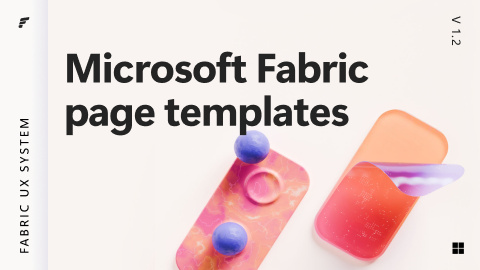

# Microsoft Fabric page templates (Community)

**Source:** Figma file `FD2eU3MUKTYuQDYP7jEDRf`
**Captured:** 2026-05-19
**Absorbed:** 2026-05-22
**Priority:** medium
**Status:** absorbed — no new components; one composition carry-forward

## What it is

Page-level compositions for Microsoft Fabric (their analytics +
data-warehouse platform). Six pages total, but only two are
substantive: **Page templates** (7 frames of full-page BI surfaces)
and **Pattern: Monetization** (14 frames showing upsell/upgrade
flows inside the product).

This is the **closest semantic match** in the entire 70-file corpus
to TUX/Landscape — Microsoft Fabric is Microsoft's research-grade
data-analytics product. Page templates here are conceptual cousins
to `landscape-dashboard.vue` and `tti-ai-studio-session.vue`.

## Pages (6)

- `0:1` — Cover _(skip)_
- `8903:699551` — **Getting started** _(4 frames — kit docs)_
- `6905:205998` — **Page templates** _(7 frames — BI dashboard
  compositions: detail page, list/table page, dashboard, settings,
  empty state, error state, loading state)_
- `12904:81235` — **Pattern: Monetization** _(14 frames — paywall,
  upgrade prompt, trial banner, limit-reached, expanded plan
  comparison)_
- `6905:211770` — **Local components** _(25 frames — page-template
  specific atoms, mostly compositions of the Fabric UI kit's
  primitives)_

## Skip

- **Visual style.** Fabric uses bright purple/orange gradients + 3D
  rendered glassy capsules for hero imagery. Not TUX (paper grain
  + maroon signature rule + restrained photography).
- **The Monetization pattern wholesale.** TTI is a research
  institute, not a SaaS platform — no paywalls, no upgrade flows,
  no plan-comparison tables. There's a small-print carry-forward
  (see Absorb #2) but the bulk of the pattern doesn't apply.
- **Getting Started / kit docs.** Internal Figma file admin; not
  relevant.

## Absorb

1. **The 7-frame page-template set is the right inventory for any
   BI-platform design system.** Confirms our own composition list:
   - **Detail page** — single record deep-dive. TUX has
     `app/pages/examples/research-landing.vue` as the canonical
     pattern.
   - **List/table page** — paginated dense data. TUX has
     `TuxRichDataGrid` + `TuxResultCount` + `TuxLoadMore` /
     `TuxInfiniteScroll`.
   - **Dashboard** — KPI row + chart row + activity feed.
     `landscape-dashboard.vue` is the canonical example.
   - **Settings** — form-stack with sectioned categories. TUX has
     `TuxInfoLabel` + `UInput`/`USelect`/`USwitch` + section
     headings.
   - **Empty state** — `TuxEmptyState` (with `kind` presets).
   - **Error state** — `TuxAlert` (intent="error") +
     `TuxEmptyState` (kind="not-found") for whole-page errors.
   - **Loading state** — `TuxSkeleton` + `UProgress` for
     determinate, `USpinner` for indeterminate.

   **Decision: no new component. Confirmation that our composition
   library already covers the canonical BI page-template set.**

2. **Tiny lesson from the Monetization pattern that does apply:**
   "Limit-reached banners" use **a top-of-content notice bar with
   a clear CTA + a dismiss control**. In TUX terms that's
   `TuxAlert` (intent="warning", dismissible=true) anchored at the
   top of a content region. Already covered; reaffirms the choice.

## Tension

- **"Microsoft has a BI page-template kit so we should ship one
  too" temptation.** No — page templates in TUX live as
  `app/pages/examples/*.vue` (executable Vue, dogfooded against
  real surfaces). Designing them as "templates" in isolation is
  the wrong abstraction; consumer-shaped example pages are the
  right one.
- **Subtle visual envy.** Fabric's purple-gradient hero is
  attention-grabbing. Resist. TUX's paper-grain + maroon signature
  rule + real photography is the editorial-research character.

## Decisions

- **No new components.** Page-template inventory confirmed; all 7
  canonical pages have a TUX path.
- **No new design-doc entry** specifically calling out "canonical
  page templates" — `app/pages/examples/` already serves that
  role. If a future contributor asks "what page templates do we
  have?", point them at the examples directory.
- **Keep as medium priority** in INDEX (unlike most other MS files)
  because the page-template confirmation is genuinely useful — it
  validates the example-pages directory as the right vehicle for
  this knowledge.

## Open follow-ups

- Consider adding a `app/pages/examples/index.vue` (gallery of all
  examples with thumbnails) so contributors can scan the
  page-template inventory visually. Today they have to know to
  look at the directory listing. **Defer** — wait for someone to
  actually need it.
- If TTI ever runs a paid Landscape tier (unlikely but possible),
  Monetization-pattern absorption would gain relevance. Currently
  out of scope.
