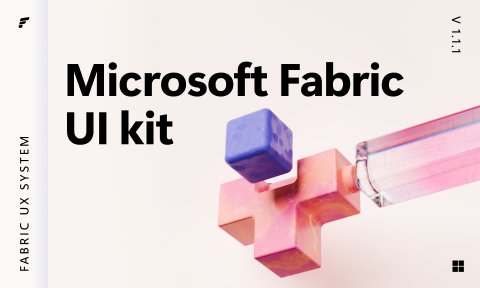

# Microsoft Fabric UI kit (Community)

**Source:** Figma file `9D9WUCluDPOjU6a8PvWg7c`
**Captured:** 2026-05-19
**Absorbed:** 2026-05-22
**Priority:** medium
**Status:** absorbed — no new components

## What it is

The "complete" 64-page atomic component library for the Microsoft
Fabric design system — basically **Fluent 2 specialized for the
Fabric BI product**. Every Fluent 2 atom is here, plus a handful of
data-platform-specific compositions (Rich data grid, Side
navigation, Multiview, Suite header, Status bar, Wizard).

Already absorbed the parent system as **Microsoft Fluent 2 Web** in
the high-signal pass. This file is the Fabric-flavored variant.

## Pages (64)

Selected highlights (full list in stub above) — mapping to TUX:

| Fabric atom | TUX coverage | Notes |
|---|---|---|
| Accordion · Accordion menu | `UAccordion` | Different from Accordion menu (nested tree-like); Fabric variants don't add new shape |
| Badge · Tags · Filter pill | `TuxBadge` + `TuxRemovableChip` | All three Fabric shapes covered |
| Banner · Message bar · Toast | `TuxAlert` (3 intents + dismissible) + `TuxStatusToast` | Three Fabric shapes map to two TUX components by semantics |
| Bottom pane · Drawer · Modal · Dialog | `USlideover` + `UModal` + `UDialog` | Bottom-anchored slide-up = `USlideover position="bottom"` |
| Breadcrumb | `TuxBreadcrumbs` | shipped |
| Button | `TuxButton` (already audited against shadcn matrix) | covered |
| Canvas control | (skip) | Figma-internal; not a Vue component |
| Card | `TuxCard` family | 11 Fabric variants ≈ TUX card variants |
| Carousel | `UCarousel` + `TuxCardCarousel` | shipped |
| Checkbox · Radio · Switch | `UCheckbox` / `URadioGroup` / `USwitch` | Nuxt UI |
| Dropdown · Menu · Popover | `UDropdownMenu` / `USelectMenu` / `UPopover` | Nuxt UI; TuxDropdown for nav-bar variant |
| Dynamic tab · Tablist | `TuxTabs` (UTabs wrapper) | shipped |
| Empty state | `TuxEmptyState` (with `kind` presets) | shipped |
| Field · Input · Label · Text area | `UInput` / `UTextarea` / `TuxInfoLabel` | covered |
| Hover card | `UPopover` triggered on hover | composition, not a separate component |
| Left rail · Side navigation | `app/layouts/sidebar.vue` | shipped |
| Link | `<NuxtLink>` + `.link-tti` utility | covered |
| Modal · Overlay | `UModal` + Reka overlay primitive | covered |
| **Multiview** | **No direct TUX equivalent** — see Absorb #1 |
| Pagination | `UPagination` + `TuxResultCount` + `TuxLoadMore` + `TuxInfiniteScroll` | full family shipped 2026-05-21 |
| Progress bar | `UProgress` | covered (see Progress Bar UI Kit audit) |
| Rating · Thumb rating | (none — out of scope) | TUX doesn't surface review-style ratings |
| **Ribbon** | (skip — Office-specific UI metaphor) | Not a TUX target surface |
| **Rich data grid** | `TuxRichDataGrid` | shipped; 4 Fabric variants validate the inventory |
| Search box | `UInput type="search"` + `UDashboardSearchButton` | covered |
| Skeleton · Spinner | `TuxSkeleton` + `USpinner` | covered |
| Slider · Spin button | `USlider` / `UInputNumber` | Nuxt UI |
| Status bar | (no equivalent — see Absorb #2) | App-bottom strip; no consumer need |
| **Suite header** | `TuxSiteNav` covers single-app; multi-app switcher unbuilt | See Absorb #3 |
| Table | `TuxTable` / `TuxDataTable` | covered |
| Teaching banner · Teaching popover | `TuxTeachingPopover` | shipped from Fluent 2 absorption |
| Toolbar | Compose `UButtonGroup` | no wrapper |
| Tooltip | `TuxTooltip` (UTooltip wrapper) | shipped |
| Tree | `UTree` (Nuxt UI) | covered |
| **Wizard** | `TuxStepper` + form-stack composition | see Absorb #4 |

## Skip

- **Ribbon.** The Office-style multi-section toolbar with grouped
  icons + labels. Specific to desktop productivity apps; not a TUX
  surface. Skip wholesale.
- **Canvas control.** Figma-internal placeholder for "the canvas
  area where your viz draws." Not a UI component.
- **Rating / Thumb rating.** TUX has `TuxReactionBar` for
  helpful/unhelpful semantics; we don't surface 5-star ratings.
- **Rebuilding the Fluent 2 atom set.** Already absorbed; the
  Fabric variants don't introduce new shape, just product-specific
  tints.

## Absorb

1. **Multiview** (`6536:235928`) — a single-frame primitive that's
   a multi-pane in-page layout: left pane is a list of records,
   right pane is the selected record's detail, optionally with a
   third pane below for related data. Common in BI tools ("master-
   detail with context"). **TUX doesn't have a direct equivalent**
   — we have full-app shell (sidebar.vue) and we have single
   surface (default.vue), but not "in-page split where the URL
   reflects which record is selected." **Defer** — wait for
   Landscape or tti-ai-studio to ask. Note the pattern: pane
   ratios via CSS grid (`grid-template-columns: minmax(280px, 1fr)
   2fr`), URL-bound record selection, optional bottom pane.

2. **Status bar** — the application-bottom strip showing "Saved at
   3:42pm · Syncing · 3 errors". Office desktop pattern; not on
   any TUX consumer's roadmap. Skip until asked.

3. **Suite header** (`2915:157164`) — Microsoft's multi-app
   switcher (waffle icon → grid of apps). TTI has multiple
   consumer apps (Landscape + tti-ai-studio); a suite header
   could let users hop between them. **Defer** — wait for the
   actual need (today users keep separate tabs). When it lands,
   it's a `TuxAppSwitcher` (waffle button + popover with app
   tiles), not a wrapper around `TuxSiteNav`.

4. **Wizard** (`2915:198500`, 5 frames) — Figma shows a multi-step
   form with `TuxStepper`-shaped progress + a form pane + back/
   next buttons. **TUX covers this by composition**, not a
   wrapper: `<TuxStepper>` above + form fields + a footer row
   with back/next `UButton`s. The 5 Fabric frames are all
   variants of this composition. Confirms our approach; no new
   component.

## Tension

- **"Microsoft has 64 components — TUX has ~95. Are we missing
  things?"** TUX has more components partly because we count
  composites Microsoft splits into atoms (e.g., `TuxFactoid`,
  `TuxBigStat`, `TuxStatComparison` would be one composable in
  Fabric). Don't drift to atom-counting parity.
- **Multiview is genuinely missing in TUX.** The honest answer is
  "we haven't needed it yet" — but as Landscape's research-record
  surface grows, master-detail-with-context could become real.
  Track in roadmap.

## Decisions

- **No new components today.** Multiview is the only genuine gap;
  defer until a consumer needs it.
- **Add a roadmap note** for `TuxMultiview` (or whatever name fits)
  — see Open follow-ups. Won't ship without consumer pull.
- **Cross-reference** to Fluent 2 Web audit as the canonical
  atom-level absorption record.

## Open follow-ups

- **Roadmap note: `TuxSplitPane`** (working name for Multiview) —
  in-page master-detail layout with URL-bound selection and an
  optional bottom pane. Surface candidate: Landscape's "browse
  records" page. Add to `design/roadmap.md` Priority C / "Layout"
  bucket if/when threading roadmap on next pass.
- **Roadmap note: `TuxAppSwitcher`** — waffle button + popover
  grid for hopping between TTI consumer apps (Landscape ↔
  tti-ai-studio ↔ future). Defer until users ask.
- Confirm `TuxWizard` is not needed — composition of
  `TuxStepper` + form is the right path.
