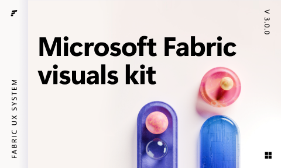

# Microsoft Fabric visuals kit (Community)

**Source:** Figma file `wuWkA8zJtuhWycSbLBiAAD`
**Captured:** 2026-05-19
**Priority:** medium
**Status:** stub — not yet absorbed

## Pages (11)

- `0:1` — 🖼️ Cover _(1 top-level frames)_
- `70:12723` — ✨ Get started _(4 top-level frames)_
- `1399:1162` — 📝 Changelog _(1 top-level frames)_
- `1:2` —     _(0 top-level frames)_
- `698:63997` — 𝗚𝗨𝗜𝗗𝗔𝗡𝗖𝗘 _(1 top-level frames)_
- `1:13566` — Iconography  _(4 top-level frames)_
- `33:42342` — Illustration _(48 top-level frames)_
- `1:13549` —     _(0 top-level frames)_
- `1:5` — 𝗟𝗜𝗕𝗥𝗔𝗥𝗜𝗘𝗦 _(0 top-level frames)_
- `52:2527` — Iconography _(1 top-level frames)_
- `698:64140` — Illustration _(9 top-level frames)_

## Skip

_TBD_

## Absorb

_TBD_

## Tension

_TBD_

## Decisions

_None yet._

## Open follow-ups

- Render previews of priority pages and write per-page NOTES.md
