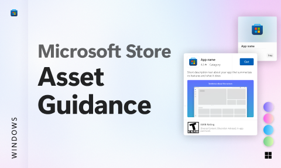

# Microsoft Store Asset Guidance (Community)

**Source:** Figma file `AB3klc5ASVy2MfUHHHTIiC`
**Captured:** 2026-05-19
**Priority:** medium
**Status:** stub — not yet absorbed

## Pages (5)

- `1:5` — Cover _(1 top-level frames)_
- `4012:551` — ------ _(0 top-level frames)_
- `2100:84` — Change Log _(1 top-level frames)_
- `4011:2171` — Asset Guidance _(3 top-level frames)_
- `22:1214` — Templates _(1 top-level frames)_

## Skip

_TBD_

## Absorb

_TBD_

## Tension

_TBD_

## Decisions

_None yet._

## Open follow-ups

- Render previews of priority pages and write per-page NOTES.md
