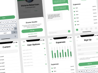

# Mobile UI kit (Community)

**Source:** Figma file `c0JQY6E8RUgkA7LNjRfVps`
**Captured:** 2026-05-19
**Priority:** skip
**Status:** stub — not yet absorbed

## Pages (3)

- `194:1561` — Cover _(1 top-level frames)_
- `0:1` — Mobile UI Kit _(30 top-level frames)_
- `143:0` — Components _(9 top-level frames)_

## Skip

_TBD_

## Absorb

_TBD_

## Tension

_TBD_

## Decisions

_None yet._

## Open follow-ups

- Render previews of priority pages and write per-page NOTES.md
