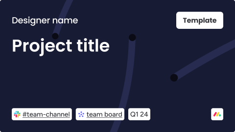

# monday.com project template (Community)

**Source:** Figma file `KUqHJmBt7jvR5gVKr32BTt`
**Captured:** 2026-05-19
**Priority:** skip
**Status:** stub — not yet absorbed

## Pages (9)

- `0:1` — 📖 Overview _(2 top-level frames)_
- `1:2` — 🧪 Research & references _(2 top-level frames)_
- `1:3` — -------------------------- _(0 top-level frames)_
- `1:4` — 🚧 Playground v1  _(3 top-level frames)_
- `1:6` — -------------------------- _(0 top-level frames)_
- `1:7` — 📦 Handoff & final designs _(5 top-level frames)_
- `1:8` — 📂 Prototypes & tests _(3 top-level frames)_
- `1:9` — -------------------------- _(0 top-level frames)_
- `1:12` — 🗄️ Archive _(0 top-level frames)_

## Skip

_TBD_

## Absorb

_TBD_

## Tension

_TBD_

## Decisions

_None yet._

## Open follow-ups

- Render previews of priority pages and write per-page NOTES.md
