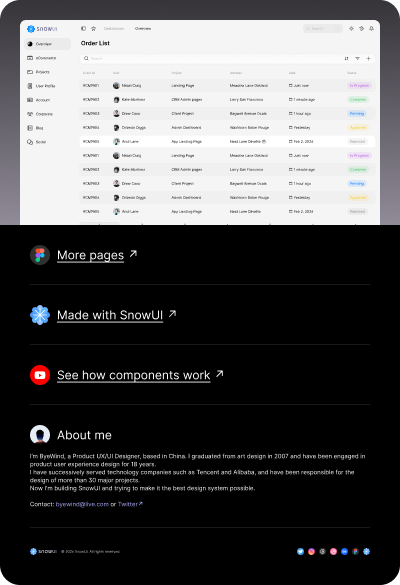

# Order list page (Community)

**Source:** Figma file `VNvD9jcIAP4t7ZmbI2NrqM`
**Captured:** 2026-05-19
**Absorbed:** 2026-05-22
**Priority:** medium → skip (Snow-derivative)
**Status:** absorbed — no new components

## What it is

A single-flow extraction from the **Snow Dashboard UI Kit**
(`tqAV0JlxQFwFALbBYU5S28`): the "Order List" page lifted into its
own file. The cover and chrome — left sidebar with collapsible
groups (Favorites · Dashboards · Pages · Charts · ...), top app
bar with breadcrumb + search, paginated data table with sortable
columns + row-status badges — are 1:1 with Snow's main file.

The "Made with SnowUI" page (3:3809) explicitly links back to the
parent kit. This is a marketing artifact, not a new system.

## Pages (4)

- `0:1192` — Page _(4 frames: the order-list table at default,
  sorted, filtered, and hovered-row states)_
- `28:2011` — Design system _(skip — Snow's token grid; covered in
  the parent file's audit)_
- `3:3809` — Made with SnowUI _(skip — promo)_
- `0:1` — Cover _(skip)_

## Mapping (delta vs Snow parent)

The only new "pattern" here is the **dense order-list table**
itself. Snow's main file shows a richer dashboard composition; this
file zooms into one tabular page.

| Order-list pattern | TUX coverage |
|---|---|
| Paginated table with column-sort indicators | `TuxRichDataGrid` (multi-column sort + `#headerMenu` per-column slot + pagination) |
| Row-status pill badges (Completed / Pending / In Progress / Cancelled / Rejected) | `TuxBadge` with `tone` prop (success / warning / brand / muted / error) |
| Checkbox-row multi-select | Roadmapped on `TuxRichDataGrid` (`selectable` prop) — not yet shipped, but it's the right wrapper for the eventual build |
| "Showing 1–24 of 412" result count + page-size picker | `TuxResultCount` (shipped 2026-05-21 in the roadmap-clear batch) |
| Top-row toolbar (Add · Filter · Sort · Search) | Compose `UButton` + `TuxFilterPanel` (already covers chip-filter UX) |

## Skip

- **The kit's chrome.** Same Snow look — soft shadows, rounded
  chips, pastel KPI fills. Stays in Snow; TUX is editorial.
- **The whole file, really.** It adds zero patterns over what the
  parent Snow audit already documented.

## Absorb

- **One pattern note:** when `TuxRichDataGrid` adds row-selection,
  the standard surface is **header-row checkbox (select all in
  view) + per-row checkbox + a "Selected: N" actions bar above the
  table** with batch actions (Export / Delete / Archive). This is
  the canonical CRM-style table interaction Snow shows and that
  Landscape will eventually need for batch-tagging research items.
  Capture as a roadmap note on `TuxRichDataGrid`, not a new
  component.

## Tension

- **Re-absorbing a derivative.** This file just rehouses a single
  Snow page. The temptation is to write yet-another full audit; the
  honest answer is "see the parent file." Avoid duplicate work.

## Decisions

- **No new components.** Everything maps to existing TUX or already-
  roadmapped surfaces (`TuxRichDataGrid` selection).
- **Downgrade priority** to skip on next INDEX rebuild — it's a
  derivative file with no fresh patterns.
- **Cross-reference Snow** as the canonical audit:
  [`../snow-dashboard-ui-kit/NOTES.md`](../snow-dashboard-ui-kit/NOTES.md).

## Open follow-ups

- When `TuxRichDataGrid` gets row-selection, design the "Selected:
  N + actions bar" affordance using `TuxRemovableChip` for the
  selection-count display and `UButton`s for the actions.
