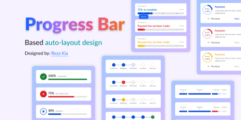

# Progress Bar UI Kit (Community)

**Source:** Figma file `5Ykj6qYG8hg0Wmmbdpqy6X`
**Captured:** 2026-05-19
**Absorbed:** 2026-05-22
**Priority:** medium
**Status:** absorbed — no new components

## What it is

A swatch sheet of progress-bar shapes, all from one author. Eight
visual variants in light-mode-only on purple/violet backgrounds:
- **Linear with percent label** at 100% / 75% / 30% — color-keyed
  to status (green / red / yellow)
- **Numbered-circle stepper** (Customer → Shipping → Process →
  Confirm → Success) — 4-step variant + 5-step variant
- **Payment-card frames** with "Previous / Next" + numbered marker
  on the linear bar — explicit step-on-progress combo

Useful only as a reminder that "progress" is not one shape — it's a
family of shapes covering different semantics (continuous / discrete /
state-laden).

## Pages (2)

- `111:333` — Cover _(1 frame)_
- `799:98620` — Components _(7 frames covering all variants above)_

## Skip

- **Their palette.** Purple/violet bg + saturated green/red/yellow.
  Not TUX. Our status colors come from `--status-success`,
  `--status-error`, `--status-warning` tokens (already used in
  TuxAlert, TuxBadge intents).
- **Light-mode only.** TUX requires three-theme support (tti /
  tti-dark / tti-hc). Source values lifted to dark/HC via
  `tokens.css`.
- **Rebuilding any of these.** Every variant is already covered:

| Figma shape | TUX coverage |
|---|---|
| Linear with % label, status-colored | `UProgress` (Reka, Nuxt UI 4) + `:color` prop bound to `success / error / warning`. Used today in `app/pages/forms/all-in-one.vue` and dashboards |
| Numbered-circle horizontal stepper | `TuxStepper` (`orientation="horizontal"`, container-query auto-collapses to vertical < 30rem) |
| Numbered-circle vertical stepper | `TuxStepper` (`orientation="vertical"`) — same component, different prop |
| Per-step status overrides (✓ done, ● active, ○ todo, ⚠ error) | `TuxStepper` `items[i].status` (`"done" \| "active" \| "todo" \| "error"`) |
| Linear with numbered "checkpoint" markers | Not a single TUX component, but composable: `UProgress` + absolutely-positioned `TuxStepper` dots. Wait for a real consumer before unifying |
| Token-utilization "X% of context used" meter | `TuxContextMeter` — different semantics (budget, not task progress), so keeps its own component |

## Absorb

1. **The taxonomy.** Three distinct semantics:
   - **Continuous progress** (% complete, indeterminate): `UProgress`
   - **Discrete progress** (step N of M with known stops): `TuxStepper`
   - **Resource utilization** (used / max with optional cost):
     `TuxContextMeter`

   This taxonomy is implicit in `design/components.md` (rows for each
   exist) but never spelled out as a "which one do I use" decision.
   Add a short Conventions subsection if/when a contributor asks —
   not pre-emptively.

2. **Status-colored linear bars at terminal states.** When a job
   finishes or fails, `UProgress` should switch from neutral to
   `success` or `error` and stay at 100% (don't reset to 0%). Confirm
   this is the pattern by scanning current usages — if any consumer
   resets to 0% on error, that's a cleanup follow-up. Not blocking;
   note here.

## Tension

- **"We need a `TuxProgressBar`."** No we don't. `UProgress` covers
  the linear case fully; adding a wrapper just to brand the bar a
  different color doesn't earn its weight. The cases where a wrapper
  helps (status-colored on completion, ticker-style indeterminate)
  are 1-line consumer compositions, not a new component.

## Decisions

- **No new components.** `UProgress` + `TuxStepper` + `TuxContextMeter`
  cover the family fully.
- **No new Conventions doc entry yet.** Wait for a contributor to
  ask "which progress thing do I use?" Then add the 3-row decision
  table to `design/components.md`. Premature without that signal.
- **Downgrade priority** to skip on next INDEX rebuild.

## Open follow-ups

- Sweep current `UProgress` usages: ensure error states stay at
  100% with `color="error"`, not reset to 0%. (Likely already
  correct; flagged as a routine audit.)
- If a "labeled checkpoint" linear bar is ever needed (linear bar
  with numbered stops above), build it as a single composition in
  whatever consumer needs it. Don't pre-build a component.
