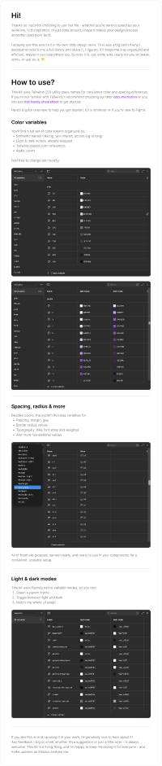

# shadcn_ui components with variables & Tailwind classes — Updated January 2026

**Source:** Figma file `JSuYy2vg3BS7S3ELeBoJoz`
**Captured:** 2026-05-19
**Priority:** high
**Status:** absorbed — gap analysis written; follow-ups audited and resolved (2026-05-19)



## What it actually is

The most current shadcn-family Figma reference (88 pages). Three things
make it more valuable than the older `@shadcn_ui - Design System` file
(also in this project):

1. **Token-first.** Every component renders in light + dark from Figma
   variables that map directly to **Tailwind v4 class names**. This is
   the same model TUX uses ([`design/tokens.json`](../../../design/tokens.json) → CSS
   variables → Tailwind `@theme`). See `about-library.png` — the kit
   explicitly says: "This kit uses Tailwind CSS utility class names for
   consistent color and spacing references."
2. **Up to date.** Cover says "Updated January 2026" — includes recent
   additions (`Empty`, `Field`, `Input Group`, `Item`, `Kbd`,
   `Native Select`, `Spinner`, `Button Group`) that the older shadcn
   file lacks.
3. **Composable.** Includes Examples (Dashboard, Tasks, Playground,
   Authentication) and Blocks (Sidebar, Login, Signup, OTP, Calendar)
   — full assemblies that show how primitives compose.

## Component coverage — TUX vs shadcn

Three buckets. (TUX has 78 Tux* components; shadcn ships ~55 primitives.)

### 1. Both have a wrapper — verify variant parity

shadcn has it, **TUX has a `Tux*` wrapper** — check that variants line up.

| shadcn | TUX | Notes |
|---|---|---|
| Accordion | [TuxAccordion](../../../app/components/TuxAccordion.vue) | |
| Alert | [TuxAlert](../../../app/components/TuxAlert.vue) | TUX adds `tip` variant (violet) — see [app/app.config.ts](../../../app/app.config.ts) |
| Badge | [TuxBadge](../../../app/components/TuxBadge.vue) | |
| Breadcrumb | [TuxBreadcrumbs](../../../app/components/TuxBreadcrumbs.vue) | |
| Button | [TuxButton](../../../app/components/TuxButton.vue) | shadcn ships **size×variant** matrix (Small/Default/Large × Solid/Outline/Secondary/Ghost/Destructive/Link). See `component-button.png` |
| Card | [TuxCard](../../../app/components/TuxCard.vue), [TuxCardSlab](../../../app/components/TuxCardSlab.vue) | TUX splits into two; shadcn has one |
| Chart | TuxChartFrame + TuxChart{Geographic,Sunburst}, TuxSparkline, TuxTreemap, TuxVizGrid | TUX much richer (research data viz) |
| Command | [TuxCommandPalette](../../../app/components/TuxCommandPalette.vue) | |
| Data Table | [TuxDataTable](../../../app/components/TuxDataTable.vue) | TUX uses TanStack Table + Virtual per [tux.md](../../../design/tux.md) |
| Dropdown Menu | [TuxDropdown](../../../app/components/TuxDropdown.vue) | |
| Empty (NEW) | [TuxEmptyState](../../../app/components/TuxEmptyState.vue) | |
| Kbd (NEW: "KPD" typo in file) | [TuxKbd](../../../app/components/TuxKbd.vue) | |
| Navigation Menu | [TuxMegaMenu](../../../app/components/TuxMegaMenu.vue), [TuxSiteNav](../../../app/components/TuxSiteNav.vue) | TUX splits institutional nav into two |
| Pagination | [TuxPagination](../../../app/components/TuxPagination.vue) | |
| Sheet | [TuxSlideover](../../../app/components/TuxSlideover.vue) | Same idiom |
| Sidebar | [TuxSidebarBlock](../../../app/components/TuxSidebarBlock.vue) + `app/layouts/sidebar.vue` | **shadcn richer — see "Concrete gaps" below** |
| Skeleton | [TuxSkeleton](../../../app/components/TuxSkeleton.vue) | |
| Table | [TuxTable](../../../app/components/TuxTable.vue) | Separate from TuxDataTable (presentation vs data) |
| Dialog | [TuxModal](../../../app/components/TuxModal.vue) | |

### 2. shadcn has it — TUX leans on Nuxt UI directly

These shadcn primitives don't have Tux* wrappers because TUX's stack
([tux.md](../../../design/tux.md) → Stack) uses Nuxt UI 4 / Reka UI as
the primitives layer. Verify each is reachable as `U*` without a Tux
wrapper layer:

| shadcn primitive | Likely Nuxt UI | Verify |
|---|---|---|
| Alert Dialog | `UModal` w/ confirm preset | ✓ |
| Aspect Ratio | CSS / no component | n/a |
| Avatar | `UAvatar` | ✓ |
| Calendar | `UCalendar` | ✓ |
| Checkbox | `UCheckbox` | ✓ |
| Collapsible | `UCollapsible` | ✓ |
| Combobox | `UInputMenu` | ✓ |
| Context Menu | `UContextMenu` | ✓ |
| Date Picker | Composed from `UCalendar` + `UPopover` | ⚠ pattern, not primitive |
| Drawer | `USlideover` w/ `direction="bottom"` | ✓ |
| Field (NEW) | `UFormField` | ⚠ |
| Hover Card | `UPopover` w/ hover trigger | ⚠ |
| Input Group (NEW) | Compose `UInput` + `UButton` | ⚠ |
| Input OTP | `UPinInput` | ✓ |
| Input | `UInput` | ✓ |
| Item (NEW) | List item primitive — n/a | n/a |
| Label | `ULabel` | ✓ |
| Menubar | `UDropdownMenu` w/ horizontal | ⚠ |
| Native Select (NEW) | `USelectMenu` w/ `native` | ⚠ |
| Popover | `UPopover` | ✓ |
| Progress | `UProgress` | ✓ |
| Radio Group | `URadioGroup` | ✓ |
| Scroll-area | n/a (CSS) | n/a |
| Select | `USelectMenu` | ✓ |
| Separator | `USeparator` | ✓ |
| Slider | `USlider` | ✓ |
| Sonner | `useToast()` / `UNotifications` | ✓ |
| Spinner (NEW) | `Icon name="lucide:loader-2"` w/ animate-spin | ⚠ pattern |
| Switch | `USwitch` | ✓ |
| Tabs | `UTabs` | ✓ |
| Textarea | `UTextarea` | ✓ |
| Toggle Group | `URadioGroup` w/ button style | ⚠ |
| Toggle | `USwitch` style? | ⚠ |
| Tooltip | `UTooltip` | ✓ |
| Carousel | **not in Nuxt UI** — would need a wrapper or external | **gap** |
| Button Group (NEW) | Compose `UButton` w/ `:ui` overrides | ⚠ |

⚠ = composable but no clean default; might warrant a Tux thin wrapper
for ergonomics. **gap** = no primitive at all.

### 3. TUX has it — shadcn doesn't (institutional ground)

TUX's editorial / research / institutional surface area shadcn doesn't
touch. These are TUX's reason for existing:

- **Editorial:** TuxAnnouncementBanner, TuxBetaRibbon, TuxBlockquote,
  TuxCTA, TuxCallout, TuxCaptionedMedia, TuxFactoid, TuxPageHeader,
  TuxProse, TuxSectionHeader, TuxTOC
- **Navigation idiom (institutional):** TuxAlphaNav, TuxDocsSidebar,
  TuxDocsSidebarNode, TuxFooter, TuxIdentity, TuxLinkList, TuxLinkSlab,
  TuxMediaSlab, TuxMegaMenu, TuxMetroInset, TuxSiteNav, TuxStepper
- **Research / data dense:** TuxBigStat, TuxChartGeographic,
  TuxChartSunburst, TuxContextPanel, TuxDescriptionList, TuxDiagram,
  TuxFilterPanel, TuxRichDataGrid, TuxReportFrame, TuxReportPrintSheet,
  TuxReportWebFrame, TuxSparkline, TuxTree, TuxTreeNode, TuxTreemap,
  TuxVizEmbed, TuxVizGrid, TuxVizRPlot
- **AI / chat / studio:** TuxChatMessage, TuxCitations, TuxComposer,
  TuxConversationList
- **Other institutional:** TuxBigStat, TuxContactCard, TuxCookieConsent,
  TuxErrorPage, TuxExample, TuxIconFeature, TuxNewsCollection, TuxQACollection,
  TuxSearch, TuxShortcutsHelp, TuxSignupFeature, TuxTestimonial

Confirms TUX's design-system thesis: shadcn ships **primitives**, TUX
ships **opinionated institutional patterns**. Don't try to converge.

## Skip

- The 6 Examples (Dashboard, Tasks, Playground, Authentication) — these
  are shadcn's *visual identity demos*. Useful as composition reference,
  but they're TUX's competition, not its input
- 5 Icon-library pages (Lucide, Tabler, HugeIcons, Phosphor, Remix) —
  TUX has settled on **Lucide via Iconify** per [tux.md](../../../design/tux.md)
- The two `---` divider pages

## Absorb

### Audit results (2026-05-19) — most "gaps" dissolved

After auditing `node_modules/@nuxt/ui/dist/runtime/components/` and the
existing Tux* components, the original list of follow-ups shrank
significantly. Findings:

**Sidebar — `UDashboardSidebar` exists in Nuxt UI 4.** The earlier
draft of this file proposed building "TuxRailNav" because shadcn's
Sidebar looked richer than what TUX had. **That was wrong.** Nuxt UI 4
ships a full Dashboard suite:

```
UDashboardGroup            UDashboardSearch        UDashboardSidebarToggle
UDashboardNavbar           UDashboardSearchButton  UDashboardToolbar
UDashboardPanel            UDashboardSidebar
UDashboardResizeHandle     UDashboardSidebarCollapse
```

`UDashboardSidebar` already provides: brand-header slot, user-footer
slot, collapsible to icon-only, mobile overlay (slideover/modal/drawer
modes), persistent open/collapsed state via cookie/local/session, and
the resizable handle. Everything shadcn's Sidebar offers and more.

**Action taken:** rewrote
[`app/layouts/sidebar.vue`](../../../app/layouts/sidebar.vue) to compose
`UDashboardGroup` + `UDashboardSidebar` + `UDashboardPanel`. Dropped
~70 LOC of hand-rolled responsive CSS and gained shadcn-Sidebar parity
for free. Slot surface is now: `#header` (top bar),
`#rail-header`/`#rail`/`#rail-footer` (rail sections with
`{ collapsed, collapse }` scope), default (main content).

**Separately:** [`TuxDocsSidebar`](../../../app/components/TuxDocsSidebar.vue)
+ [`TuxDocsSidebarNode`](../../../app/components/TuxDocsSidebarNode.vue) remain
the right pattern for **documentation-site** rails (tree of links with
sessionStorage persistence, inline search, active-trail). Don't merge.
[`TuxSidebarBlock`](../../../app/components/TuxSidebarBlock.vue) is a third
unrelated thing — an in-page editorial widget, not nav rail.

**Button variants — TuxButton's reduction is deliberate.**
[TuxButton](../../../app/components/TuxButton.vue) collapses shadcn's
color×variant matrix into a single `intent` prop:
`primary / secondary / ghost / destructive`. Sizes, icons, loading,
disabled, `to` all forwarded from `UButton`. Read-through confirms
this is an editorial design choice, not an omission. Differences from
shadcn (no `link` variant, no solid-red destructive, secondary folds
in outline) are intentional. **No change.**

**January 2026 additions — most exist in Nuxt UI 4.**

| shadcn | Nuxt UI 4 |
|---|---|
| Field | ✓ `UFormField` |
| Input OTP | ✓ `UPinInput` |
| Carousel | ✓ `UCarousel` |
| Spinner | ✗ — inline `Icon` w/ animate-spin |
| Input Group | ✗ — compose `UInput` + `UButton` |
| Button Group | ✓ `UFieldGroup` likely fits |
| Toggle Group | ✗ — `URadioGroup` w/ button style |
| Hover Card | ✗ — `UPopover` w/ hover trigger |
| Menubar | ✗ — no direct equivalent |

None of the genuine gaps warrant proactive Tux wrappers. Build them
when a consumer surface forces the issue.

**Carousel — `UCarousel` exists.** Earlier draft asked "ship or skip";
moot. Wrap as `TuxCarousel` if/when a TUX surface needs one.

**Overlap to audit someday (not now).** Several Tux* have Nuxt UI 4
counterparts that may have appeared after the Tux versions were built:
`TuxFooter / UFooter`, `TuxPageHeader / UPageHeader`,
`TuxStepper / UStepper`, `TuxTree / UTree`,
`TuxChatMessage / UChatMessage`. Probably each adds TTI-specific value
(gold rule, Aggie layout, citations), but worth a check during a
future dead-code audit.

### Light/dark + token plumbing

The about-library page confirms shadcn organizes color tokens by:

1. **Semantic names** (bg, fg, text-muted, accent, bg-strong)
2. **Light + dark modes** wired at the variable layer
3. **Tailwind-based references** (slate-100, neutral-200)
4. **Radix colors** as the base hue scale

TUX's [`design/tokens.json`](../../../design/tokens.json) already follows the
same pattern — semantic theme tokens (`brand.primary`, `surface.page`,
`text.primary`) reference base palette tokens (`color.tti.maroon`,
`color.neutral.100`). The `themes.tti` / `themes.tti-hc` split is the
TUX equivalent of shadcn's light/dark mode pairs. **No new structural
work needed** — confirm parity, not migration.

## Tension

- shadcn's visual identity (clean neutrals, black/destructive-red
  accent, generic sans) is **dashboard-y by default**. TUX's
  editorial-first principle [tux.md](../../../design/tux.md) #1 means we don't
  inherit the *look* — only the *token model* and the *primitive
  parity*. Resist the temptation to make TUX look like vanilla shadcn
  on `examples/pecan-dashboard.vue` or `examples/tti-ai-studio-session.vue`.
- shadcn's Sidebar block wall shows lots of *icon-only minimal* rails
  with no labels. TUX's "data-dense where it counts" principle means
  labels stay visible on dashboard surfaces ≥xl; icon-only is the
  collapsed state, not the default.

## Decisions

- Designated shadcn (Jan 2026 file) as TUX's **primitive parity
  reference** — when adding a new shadcn-family component upstream,
  check this file's variant matrix before reimplementing
- Marked older `@shadcn_ui - Design System` file as superseded by this
  one for variant matrix purposes (6 pages vs 88; older API surface)
- **2026-05-19: Rewrote `app/layouts/sidebar.vue`** to compose
  `UDashboardGroup` + `UDashboardSidebar` + `UDashboardPanel`. Dropped
  the hand-rolled responsive CSS; gained shadcn-Sidebar parity for free.
- **2026-05-19: Did NOT build TuxRailNav.** Earlier draft of this NOTES
  proposed it; audit showed `UDashboardSidebar` covers the use case.
  Recording the no-go so future passes don't repeat the wrong call.
- **2026-05-19: Did NOT add Tux wrappers** for Field, InputGroup,
  ButtonGroup, ToggleGroup, HoverCard, Menubar, Spinner. Nuxt UI 4
  primitives cover the cases; thin wrappers would add noise without
  consumer surfaces demanding them.

## Open follow-ups

Genuinely deferred (no consumer surface forces them yet):

1. **Per-page deep-dives** for the new January 2026 components
   (`Field`, `Input Group`, `Item`, `Spinner`) when a consumer surface
   forces the question.
2. **Try `sidebar.vue`** on
   [`pecan-dashboard`](../../../app/pages/examples/pecan-dashboard.vue) and
   [`tti-ai-studio-session`](../../../app/pages/examples/tti-ai-studio-session.vue)
   to see if it earns its keep on real surfaces.
3. **Dead-code audit** for Tux* components that overlap with Nuxt UI 4
   (`TuxFooter`, `TuxPageHeader`, `TuxStepper`, `TuxTree`,
   `TuxChatMessage`). Confirm each TUX version adds TTI-specific value
   worth keeping.
