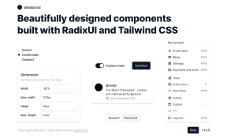

# @shadcn_ui - Design System (Community)

**Source:** Figma file `w5nwU2tVd4onabO29deMik`
**Captured:** 2026-05-19
**Priority:** high
**Status:** stub — not yet absorbed

## Pages (6)

- `2:287` — Cover _(1 top-level frames)_
- `4:6598` — Components _(27 top-level frames)_
- `0:1` — Typography _(1 top-level frames)_
- `21:1150` — Colors _(1 top-level frames)_
- `1:22` — Primitives _(28 top-level frames)_
- `4:463` — Icons _(877 top-level frames)_

## Skip

_TBD_

## Absorb

_TBD_

## Tension

_TBD_

## Decisions

_None yet._

## Open follow-ups

- Render previews of priority pages and write per-page NOTES.md
