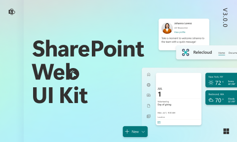

# SharePoint Web UI Kit (Community)

**Source:** Figma file `vBhRTp8YH5CpXvbOBw2nhC`
**Captured:** 2026-05-19
**Absorbed:** 2026-05-22
**Priority:** medium
**Status:** absorbed — no new components

## What it is

The design kit for **SharePoint intranet sites + CMS pages** — 45
pages spanning site chrome (theme, header, footer), page templates,
and the famous **Web Parts** library (Hero, News, Quick Links,
People, Events, etc.). The Web Parts model is SharePoint's content-
block system: pick a block, configure it, drop it on a page.

Closest TUX cousin is `app/pages/examples/research-landing.vue`
(editorial composition with hero + factoid + content blocks) —
SharePoint just productizes that idea into a non-developer-editable
page-builder.

## Pages (45)

Selected highlights (full list in stub above):

**Site chrome** (covered by existing TUX patterns):
- Theme · Logos · Header · Navigation · Content pane · Footer

**Templates** (3 sections):
- Templates · Page title · Section header

**Web Parts** (the substantive middle — 24 blocks):
- Button · Call to action · Countdown timer · Divider · **Document
  library** _(8 frames)_ · Events _(5)_ · **Hero** _(5)_ ·
  **Highlighted Content** _(11)_ · Image · **Image gallery** _(7)_
  · Link · List · **News** _(13)_ · **Organization chart** _(3)_ ·
  **People** _(3)_ · **Quick Links** _(13)_ · **Site activity**
  _(3)_ · Sites · Spacer · Stream · Text · Weather · World Clock

## Pattern → TUX mapping

| SharePoint Web Part | TUX coverage |
|---|---|
| Button | `TuxButton` / `UButton` |
| Call to action | Compose `TuxBigStat` + `UButton` (or `TuxCard` with action footer) |
| Countdown timer | **None** — defer; not on consumer roadmap |
| Divider | `
` or compose with `--rule-color` token |
| Document library | `TuxRichDataGrid` (file rows with filename/owner/modified) |
| Events | Compose `TuxFactoid` + date metadata, or `UTimeline` for list view |
| **Hero** | `TuxPageHeader` (editorial chrome) + `TuxBrandPhoto` for image-led hero |
| **Highlighted Content** | `TuxCardSlab` / `TuxMediaSlab` / `TuxNewsCollection` family |
| Image | `` or `TuxBrandPhoto` |
| **Image gallery** | `TuxPhotoGrid` + `TuxCardCarousel` (for horizontal-scroll variant) |
| Link · Sites | `<NuxtLink>` + `.link-tti` |
| List | `TuxLinkList` / `TuxLinkSlab` (general) or `TuxRichDataGrid` (tabular) |
| **News** | `TuxNewsCollection` (3 layouts: grid / list / featured) |
| **Organization chart** | `TuxTree` + `TuxTreeNode` (general tree); see Absorb #1 |
| **People** | `TuxContactCard` + `TuxTeamRoster` |
| **Quick Links** | `TuxLinkList` + `TuxIconFeature` for icon-led tiles |
| Site activity | `UTimeline` + slot content |
| Stream | (video-stream embed; out of scope) |
| Spacer | Tailwind margin utilities, not a component |
| Text | `
` + prose typography styles |
| Weather · World Clock | (skip — gimmick widgets, not TUX-relevant) |

## Skip

- **Site-chrome wholesale** (Theme · Logos · Header · Footer ·
  Navigation). TUX has `TuxSiteNav`, `TuxFooter`, and the sidebar
  layout — the SharePoint site-chrome semantics (collaboration
  ribbon, "follow site," "edit page" toggle) don't apply to a
  research-publishing surface.
- **The "edit mode" UI.** SharePoint's whole point is non-developer
  page editing in-browser. TUX consumers' content is code-managed
  (Vue files), not visually-editable. The drag-drop block authoring
  is out of scope.
- **Weather + World Clock + Stream gimmicks.** Not TUX surfaces.
- **Countdown timer** — defer; no consumer asks. If a TTI campaign
  page ever needs one, a 60-line composable can ship it without a
  full component.

## Absorb

1. **Organization chart pattern.** SharePoint's Org chart is a
   hierarchical tree of person tiles with photo + name + title.
   **TUX has `TuxTree` + `TuxTreeNode`** for arbitrary hierarchy
   rendering, and `TuxContactCard` for person cards. The two
   compose: feed a tree shape into `TuxTree` where each leaf
   renders a `TuxContactCard`. Document this composition pattern
   **only if a TTI consumer asks for an org chart**. Today no one
   does; note here and move on.

2. **Quick Links tile grid.** SharePoint's most-used Web Part —
   8-12 small tiles each with icon + label + link, often used as
   a "your shortcuts" homepage. TUX coverage:
   - `TuxLinkList` for the list/grid variant (compact, label-led)
   - `TuxIconFeature` for the icon-led tile (icon + label + short
     description)
   - Compose `TuxLinkList layout="grid" :columns="4"` for the
     classic 4×3 quick-links homepage.

   No new component needed; the composition is the value. Add a
   sentence to `design/components.md` if/when a consumer page
   uses it.

3. **The Web Parts taxonomy as a homepage block inventory.** If
   TTI ever wants a "build a research-portal landing page from
   blocks" surface (very speculative), the SharePoint Web Parts
   list is a useful starting taxonomy. Today it's not on the
   roadmap. Note for the future.

## Tension

- **SharePoint is a CMS; TUX is a code-managed design system.**
  The whole "non-dev edits the page in a WYSIWYG" model doesn't
  apply. Don't accidentally drift toward block-editor patterns
  unless TTI's research-portal product asks for them.
- **Editorial-research vs corporate-intranet.** SharePoint's
  identity is collaboration features (followers, version history,
  comments). TUX is editorial publishing chrome. Different mode.

## Decisions

- **No new components.** Every applicable Web Part maps to an
  existing TUX primitive or composition.
- **No new doc entries** until a consumer surface actually uses
  the Org chart / Quick Links grid composition.
- **Downgrade priority** to skip on next INDEX rebuild — the
  patterns are useful but the file's framing (intranet CMS)
  isn't a TUX target.

## Open follow-ups

- If TTI ever wants an "org chart for the Center" page, compose
  `TuxTree` + `TuxContactCard` and add the pattern note to
  `design/components.md`.
- If a "shortcuts homepage" surface appears, document the
  `TuxLinkList layout="grid"` composition there.
