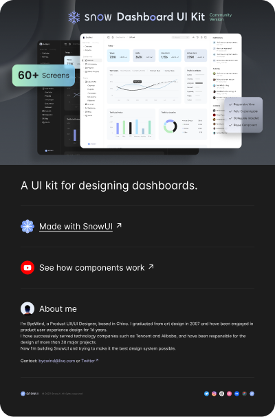

# Snow Dashboard UI Kit (Community)

**Source:** Figma file `tqAV0JlxQFwFALbBYU5S28`
**Captured:** 2026-05-19
**Absorbed:** 2026-05-21
**Priority:** medium
**Status:** absorbed — 0 new components; composition reference for Landscape

## What it is

A polished dashboard kit billed as "60+ screens, Vue + React + Figma."
Two flagship dashboard screens inspected (default analytics +
eCommerce), plus a Components page that bundles base atoms (chips,
buttons, inputs) and chart variants. The kit is a **composition
reference** — almost every pattern shown is already covered by TUX
primitives or roadmapped chart entries.

## Pages (6)

- `757:1237` — Hello _(skip)_
- `1445:10218` — Dashboard _(7 frames: Default, eCommerce, Projects,
  Online Courses, Navigation, Order List × 2)_
- `1246:28355` — Components _(Phone / Common / Base / Chart sections)_
- `1389:28159` — Design resources _(skip — Figma-internal)_
- `80903:4786` — Design system _(skip — Figma-internal token grid)_
- `43401:105049` — Made with SnowUI _(skip — showcase)_

## Frames inspected

`dashboard/`:
- `default.png` — analytics dashboard: KPI row (Views/Visits/New
  Users/Active Users with delta %), Total Users line-chart with
  current vs previous overlay + hover tooltip, Traffic by Website
  bar, Traffic by Location donut. Right rail: Notifications +
  Activities + Contacts.
- `ecommerce.png` — Customers / Orders / Revenue / Growth KPI row;
  Projections vs Actuals dual-bar; Revenue current-week vs
  previous-week line; Revenue by Location world-map; Top Selling
  Products mini-table; Total Sales donut.
- `navigation.png` — single-frame preview placeholder.

## Pattern → TUX mapping

| Snow pattern | TUX coverage |
|---|---|
| Left sidebar w/ collapsible groups (Favorites · Recently visited · Dashboards · Pages) | `app/layouts/sidebar.vue` on `UDashboardSidebar` — already shipped |
| Top app bar (search + breadcrumbs + icons) | `TuxBreadcrumbs` + `UDashboardSearchButton` — already in sidebar layout |
| KPI card row with delta percent | `TuxBigStat` (anchor) + `TuxFactoid` + `TuxSparkline` — already shipped |
| Line chart with current/prev overlay + tooltip | Roadmap Priority B: **TuxChartLine** with `previous` series + tooltip |
| Bar chart by source | Roadmap Priority B: **TuxChartBar** |
| Traffic-by-Location donut | Roadmap Priority B: **TuxChartDonut** (or compose TuxChartSunburst single-ring) |
| Revenue by Location (world map) | `TuxChartGeographic` ships Texas-flavored; world ramp not built — defer |
| Mini-table (Top Selling Products) | `TuxTable` — already shipped |
| Right-rail Notifications feed | Compose `UTimeline` + `TuxCard` — no new component |
| Right-rail Activities feed | Same — `UTimeline` + tone tokens |
| Right-rail Contacts | `TuxContactCard` — already shipped |

## Skip

- **The chrome.** Snow's character is rounded-corner pill chips,
  soft pastel KPI tile backgrounds, dotted overlays for "previous
  period." Pretty, but not TTI editorial. Maintain TUX's flat,
  paper-grain, maroon-anchored card system.
- **60+ ancillary screens** (Online Courses, Projects, Order List,
  User Profile, Account, Corporate, Blog, Social). They're product-
  specific surfaces, not design-system patterns. Reference only.
- **The kit's chart palette** (purple-led + pastel accents).
  TUX `--chart-1..8` (maroon-led) is the source of truth.
- **The "Phone" section.** Mobile-first variants are out of scope
  for the current TUX surface — desktop dashboard is where Landscape
  lives.

## Absorb

1. **Right-rail composition (notifications + activities + contacts).**
   Snow puts a fixed 280px right rail next to the main dashboard
   surface. The sidebar layout in TUX already supports a left rail;
   a **right rail / aside slot** on `sidebar.vue` would let dashboards
   compose this pattern. Today consumers can use `<aside>` inside
   the default slot — but giving the layout a named `#aside` slot
   makes the pattern discoverable. **Defer the build** until a
   real Landscape page demands it (one-off `<aside>` is fine first;
   ship the slot when two surfaces both need it).
2. **Current-period vs previous-period overlay on line charts.**
   Snow's Total Users chart draws current as solid, previous as
   dashed in the same color family, with a hover tooltip showing
   both values + the delta. **This is a TuxChartLine roadmap note**
   — same kind of carry-forward as the brush from Charts UI Kit
   and the end-of-line labels from Data Viz Graphs. The pattern is
   `series.previous` + tooltip variant.
3. **Projections vs Actuals dual-bar.** Two bars per category, one
   muted (projection) one solid (actual), overlapped so the
   difference is visible. Captures a "target vs realized" reading
   in a single bar. Roadmap note on **TuxChartBar**: support a
   `comparison` series with muted fill.

## Tension

- **Polished-SaaS vs editorial-research.** Snow's identity is
  consumer-SaaS chrome (gradients, soft shadows, pastel KPI tiles).
  TUX is research-publishing chrome (paper grain, maroon signature
  rule, restrained color). The patterns transfer; the chrome does
  not.
- **Right-rail-as-permanent vs right-rail-as-overlay.** Snow's rail
  is a permanent fixture; in a research dashboard it might compete
  with the chart-reading focus. The right rail should probably be
  **optional + collapsible** when added to TUX's sidebar layout,
  not load-bearing.

## Decisions

- **No new components.** Every pattern maps to an existing TUX
  primitive or an already-roadmapped chart entry.
- **Three roadmap notes recorded** (right-rail aside slot,
  previous-period overlay, comparison series on bars) — surfaced
  in Open follow-ups; ready to thread into `design/roadmap.md` when
  Landscape rebrand pass touches the file.
- **Composition pass deferred** — the natural next step is updating
  `pecan-dashboard.vue` (→ `landscape-dashboard.vue` after rebrand)
  to use the full sidebar + KPI row + chart pieces. That belongs in
  the rebrand task (#59), not here.

## Open follow-ups

- **`sidebar.vue`: `#aside` slot** for an optional right rail.
  Defer until two consumer surfaces both want it.
- **TuxChartLine**: support `series.previous` + tooltip variant
  showing current/previous/delta.
- **TuxChartBar**: support a `comparison` series (muted fill,
  overlapped with the primary bar).
- After PECAN → Landscape rebrand lands, **update
  `landscape-dashboard.vue`** with the full composition (sidebar
  layout + KPI row + chart row + activity-feed aside). Use this
  Snow file's `default.png` as the reference layout, swapping all
  chrome to TUX editorial.
