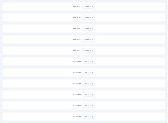

# TailwindCSS v4.2.4 Design System (Community)

**Source:** Figma file `h5ZkgyIFWVzFWRrvxPXCG1`
**Captured:** 2026-05-19
**Priority:** high
**Status:** stub — not yet absorbed

## Pages (1)

- `0:1` — Design System _(14 top-level frames)_

## Skip

_TBD_

## Absorb

_TBD_

## Tension

_TBD_

## Decisions

_None yet._

## Open follow-ups

- Render previews of priority pages and write per-page NOTES.md
