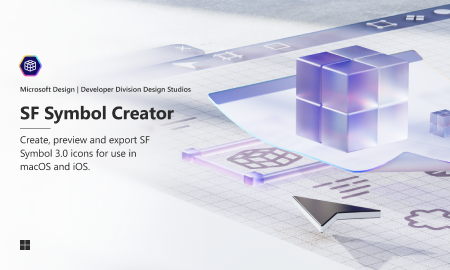

# Template for SF Symbol Creator (Community)

**Source:** Figma file `UzlTvspXZkMwi0HfVGRYsh`
**Captured:** 2026-05-19
**Absorbed:** 2026-05-22 (platform-aware lens)
**Priority:** medium → skip (audit decision; out-of-scope)
**Status:** absorbed — no new components; icon-family stance reaffirmed

> Grounded by [`design/platform-awareness.md`](../../design/platform-awareness.md).
> A Microsoft Design Studios-published template for **creating custom
> SF Symbols** for use in macOS / iOS apps. Out-of-scope for TUX —
> we stay on Heroicons.

## What it is

A 2-page template Figma file for **drawing custom SF Symbols**. SF
Symbols is Apple's icon system; this template provides the grid,
weights, scales (Small / Medium / Large), and rendering modes
(Monochrome / Hierarchical / Palette / Multicolor) Apple expects
from custom symbols.

## Pages (2)

- `0:1` — Main _(3 frames — the icon-creation template grid)_
- `215:2` — Cover _(skip)_

## Why TUX stays on Heroicons

Documented multiple times across the absorption pass (Microsoft
Fabric visuals kit, M365, etc.). The short version:

- **Heroicons** is the established TUX icon family, served via
  Iconify through `@nuxt/icon`.
- **One icon family is the right number.** Adding SF Symbols pulls
  maintenance surface for zero consumer benefit — Tauri WebViews
  render Heroicons identically on all platforms.
- **SF Symbols are Apple-only.** Even Apple's iconography
  guidance says "use SF Symbols on Apple platforms, system icons
  elsewhere." TUX targeting Mac + Win + Linux + web means we need
  a cross-platform icon family.
- **Heroicons are intentionally generic.** Their visual identity
  is "modern web icon" — neither Apple-flavored nor Microsoft-
  flavored. Fits TUX editorial-research tone.

## Skip

- **Adopting SF Symbols.** Reaffirmed.
- **Building a custom-SF-Symbol pipeline.** No consumer asks.
- **Mixing icon families on Mac builds.** Even if we wanted some
  Mac-feel chrome, mixing Heroicons (everywhere) with SF Symbols
  (titlebar buttons only) would create visual inconsistency.
  Stay all-Heroicons.

## Absorb

- **None.** This file is a creation-template, not a design system.
  TUX has no use for the template itself.

## Tension

- **"For native-feel on Mac, use SF Symbols in `TuxAppFrame`
  titlebar."** Tempting, but breaks icon-family consistency
  across platforms. Hold the line: Heroicons everywhere, including
  Mac chrome.

## Decisions

- **No new components.**
- **Reaffirm Heroicons** as the sole TUX icon family.
- **Move file from skip → medium for taxonomic consistency**, then
  **downgrade back to skip on next INDEX rebuild** — the audit
  decision is "out of scope."

## Open follow-ups

- None. Audit closed.
