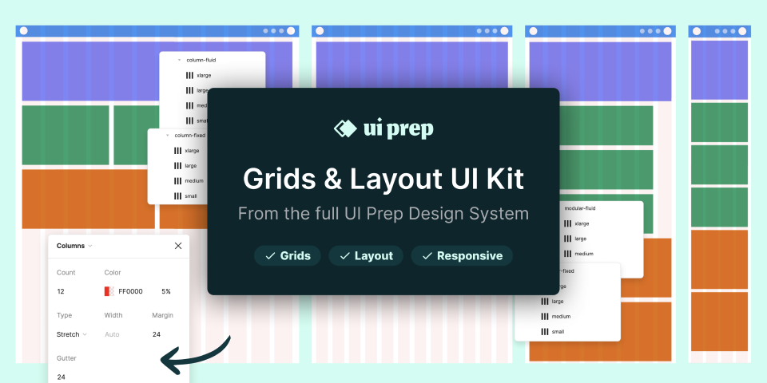

# UI Prep Layout Grids 8.0 (Community)

**Source:** Figma file `rbYG2WTnd2OVeCHnh3I2AR`
**Captured:** 2026-05-19
**Absorbed:** 2026-05-22 (platform-aware lens)
**Priority:** medium (re-bucketed from skip)
**Status:** absorbed — no new components; layout-grid sanity check

> Grounded by [`design/platform-awareness.md`](../../design/platform-awareness.md).
> A platform-agnostic Figma file on **layout grids and responsive
> design** as Figma plugin features. Cross-platform utility
> reference, not a UI system.

## What it is

UI Prep's 8.0 release of their **layout-grid + responsive-design
template** — a Figma-tools-focused file showing how to set up
12-column grids, constraints, and breakpoint cascades in Figma.
Cross-platform in the sense that grids transcend OS chrome.

## Pages (8)

- `127:2` — Cover _(skip)_
- `138:35` — **Welcome** _(18 frames — intro + docs)_
- `450:87` — Documentation separator
- `57:21` — **Layout Grid Styles** _(30 frames — column / row / module
  variants)_
- `73:4` — **Responsive Examples** _(8 frames — same page at sm /
  md / lg / xl)_
- `73:159` — **Constraint Examples** _(6 frames — Figma constraint
  patterns)_
- `450:326` — Design work separator
- `450:327` — Workflow A _(4 frames — author's process)_

## TUX layout-grid alignment

Cross-check vs TUX's existing breakpoints (from `design/tokens.json`):

| TUX breakpoint | Width | UI Prep mapping |
|---|---|---|
| `sm` | 640px | UI Prep "mobile-l" / Bootstrap sm |
| `md` | 768px | UI Prep "tablet" |
| `lg` | 1024px | UI Prep "laptop" |
| `xl` | 1280px | UI Prep "desktop" |
| `2xl` | 1536px | UI Prep "desktop-l" |

UI Prep's example grids:
- **Mobile** (sm): 4 columns, 16px margin, 16px gutter
- **Tablet** (md): 8 columns, 24px margin, 24px gutter
- **Laptop** (lg): 12 columns, 32px margin, 24px gutter
- **Desktop** (xl): 12 columns, 64px margin, 32px gutter

TUX today uses Tailwind v4's `grid-cols-*` utilities with no
formal column-count convention. We rely on `container mx-auto`
+ Tailwind's spacing tokens, which produces sensible results
without locking into a 4-col / 8-col / 12-col regime.

## Skip

- **Adopting a strict 12-column layout system.** Tailwind v4's
  grid utilities are more flexible. TUX doesn't constrain to
  12-col — components grid themselves contextually.
- **Figma-plugin-specific workflow.** UI Prep is a Figma tools
  product; not relevant to a Vue/Nuxt design system.
- **Author's Workflow A page.** Process notes; not portable.

## Absorb

1. **Sanity-check confirmed.** TUX breakpoints (`sm/md/lg/xl/2xl`)
   align with the universal "mobile / tablet / laptop / desktop /
   wide-desktop" cascade. No drift; no change needed.

2. **Margin/gutter recommendations** above are reasonable
   defaults if/when a contributor asks "what padding should a
   page have at each breakpoint?" Capture in the
   `breakpoints.vue` accessibility doc if it doesn't already
   cover it. Defer — not blocking.

3. **No new components.** Layout-grid is a Tailwind concern, not
   a TUX-component concern.

## Tension

- **Designers from a 12-col-grid background** might expect TUX to
  expose a `.col-span-4` / `.col-start-2` system. Tailwind's
  grid utilities already provide this; TUX doesn't add a layer.
- **"Should TUX have a `<TuxContainer>` wrapper?"** No. Tailwind's
  `container` utility + `max-w-*` constraints cover the cases.

## Decisions

- **No new components.**
- **TUX breakpoints unchanged.** Validated against UI Prep
  reference.
- **Move file from skip → medium → skip on next rebuild** — the
  validation is useful one-time; the file isn't a recurring
  source.

## Open follow-ups

- If `app/pages/accessibility/breakpoints.vue` doesn't cover
  margin/gutter recommendations at each breakpoint, add a row.
  Defer to the next a11y docs pass.
