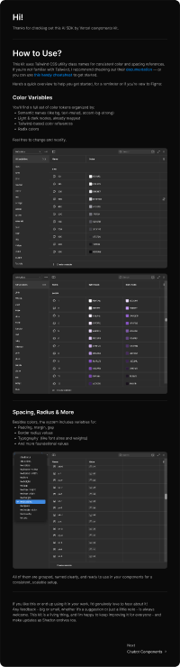

# @vercel AI Elements ✨ (Community)

**Source:** Figma file `W5sFxcGmXwFKT5iOIL4SDp`
**Captured:** 2026-05-19
**Priority:** high
**Status:** absorbed — 5 gap components + TuxCodeBlock download shipped 2026-05-20; LaTeX math + sundry items still deferred

## What it actually is

Vercel's **AI SDK Elements** reference kit (community-published by the
same designer as the shadcn (Jan 2026) file — same token-first layering
visible in the welcome page). 18 chatbot components + 1 "vibe coding"
component (Artifact). Designed against Vercel's open-source AI SDK
TypeScript primitives (`@ai-sdk/*`).

This is the most directly relevant file for [tti-ai-studio-session](../../../app/pages/examples/tti-ai-studio-session.vue)
and the eventual real tti-ai-studio consumer surface.

Frames rendered into this folder for visual reference (all 19 component
pages — full coverage):
`message.png`, `conversation.png`, `prompt-input.png`, `tool.png`,
`reasoning.png`, `branch.png`, `inline-citation.png`, `artifact.png`,
`suggestion.png`, `sources.png`, `chain-of-thought.png`, `code-block.png`,
`actions.png`, `context.png`, `image.png`, `loader.png`,
`open-in-chat.png`, `response.png`, `task.png`.

## Three-bucket gap analysis

### 1. TUX already has it — keep using

| Vercel | TUX | Notes |
|---|---|---|
| Message | [TuxChatMessage](../../../app/components/TuxChatMessage.vue) | TUX has `user` / `assistant` roles, avatar slot, `#tools` action slot, `#citations` slot, `meta` line. Richer than Vercel's bare bubble. |
| Prompt Input | [TuxComposer](../../../app/components/TuxComposer.vue) | TUX has compliance-scope banner + corpus attach + model picker + `⌘↵` shortcut. Stronger than Vercel's reference. |
| Sources | [TuxCitations](../../../app/components/TuxCitations.vue) | TUX uses `[N]` rank + title + path + score. Footer-style, distinct from inline. |
| Code Block | [TuxCodeBlock](../../../app/components/TuxCodeBlock.vue) + [TuxCodeMaroon](../../../app/components/TuxCodeMaroon.vue) | TUX has both standard + maroon variant |
| Conversation history (sidebar list) | [TuxConversationList](../../../app/components/TuxConversationList.vue) | TUX patterns past-conversation history with TODAY/YESTERDAY/THIS WEEK buckets. Vercel doesn't ship this (only in-page message list) |

### 2. Nuxt UI 4 has it — reach for `UChat*` directly

These shipped in Nuxt UI 4 (see audit in [shadcn NOTES.md](../shadcn-ui-components-with-variables-tailwind-classes-updated/NOTES.md)).
TUX does not need a wrapper unless TTI styling diverges meaningfully.

| Vercel | Nuxt UI 4 | Status |
|---|---|---|
| Conversation (in-page message list with auto-scroll) | `UChatMessages` | Use directly inside `tti-ai-studio` views |
| Reasoning (collapsible "Thought for N seconds" with streaming text) | `UChatReasoning` | Use directly |
| Tool (collapsible tool invocation w/ params + result) | `UChatTool` | Use directly |
| Loader (AI-specific shimmer) | `UChatShimmer` | Use directly |
| Prompt submit button + states | `UChatPromptSubmit` | TuxComposer already covers; consider as building block when extending |

### 3. Genuine gaps — TUX doesn't have it, Nuxt UI 4 doesn't have it

Five patterns Vercel ships that nothing else fills. All small. Build
**when** a consumer surface in tti-ai-studio (or another consumer app)
needs them — not speculatively.

| Vercel pattern | Proposed name | Sketch | Estimated LOC |
|---|---|---|---|
| **Branch** (multi-version response w/ `‹ 1 of 3 ›` nav) | `TuxBranchNav` | Prev/next chevrons + position label; emits `prev` / `next`; goes inside `TuxChatMessage` `#tools` slot or above message body | ~30 |
| **Inline Citation** (pill in body text → hover popover with source detail) | `TuxInlineCitation` | `` w/ pill style + `UPopover` on hover/focus showing title + url + excerpt. Distinct from `TuxCitations` which is the footer list | ~40 |
| **Suggestion** (horizontal row of clickable prompt chips above composer) | `TuxSuggestionChips` | Flex row of chip buttons; emits `pick(prompt: string)`. Used between empty state and first message | ~25 |
| **Context** (token-utilization % badge → hover popover showing input/output/cost breakdown) | `TuxContextMeter` | Compact badge with utilization %, `UPopover` revealing `input/output/total` tokens + cost. High value for tti-ai-studio budget visibility | ~50 |
| **Artifact** (code/file output panel with header actions: copy/save/regenerate/export) | `TuxArtifact` | Header (title + relative time + action button row) + body slot (code block, doc, table, image). Probably opens in a side panel via `app/layouts/sidebar.vue` `#aside` slot | ~80–100 |

## Skip

- The 5 icon-library page (Lucide) — TUX is settled on **Lucide via
  Iconify** ([tux.md](../../../design/tux.md) → Stack)
- The two `---` divider pages
- **Image** (AI-generated image output with metadata) — defer until a
  research surface generates images. Most TTI applications are research
  text + data, not image-generative
- **Task** (AI-output todo list) — defer; can compose from existing
  `TuxTree` or a description-list pattern when needed. The Vercel
  pattern (file-system search/scan output) is closer to a code agent's
  workflow than to TTI's corpus-research workflow
- **Chain of Thought** (search-results + image-results timeline) —
  defer; compose from `UChatReasoning` + cards when a specific surface
  asks for it. The Vercel pattern is opinionated about web-search
  preview that may not match TTI's corpus-search shape
- **Loader** (spinner) — `UChatShimmer` covers the streaming case; an
  inline `Icon name="lucide:loader-2"` with `animate-spin` covers the
  static case. No component needed
- **Open In Chat** — Vercel's dropdown is "open my query in ChatGPT /
  Claude / v0 / Cursor / T3 Chat". **TUX is the destination, not the
  source** — tti-ai-studio IS the AI tool. Inverted incentive; skip
- **Actions** — Vercel's row of icon buttons (retry/like/dislike/copy/
  share) sits below an AI message. `TuxChatMessage` already exposes
  `#tools` for exactly this. No new component; document the standard
  action set (retry, copy, share, ±feedback) as a convention so
  consumers don't each pick different icons

## Absorb

### What "absorb" actually means here

Most of what Vercel ships *is already* in TUX or Nuxt UI 4, often with
better TTI styling (compliance-scope banner on `TuxComposer`, citation
ranks on `TuxCitations`, temporal buckets on `TuxConversationList`).
The absorption is largely a **confirmation that TUX's AI surface area
matches industry-standard patterns**, plus four small additions to
fill genuine gaps.

### Stylistic patterns worth keeping in mind

- **Collapsible disclosure for AI internals** (Reasoning, Tool,
  Sources — all use a chevron-down disclosure pattern). When you're
  showing AI internals, default to collapsed; open on stream-start;
  close on stream-end. `UChatReasoning` already implements this.
- **Status pills next to tool calls** (Completed / Running / Error).
  TUX should mirror this when surfacing tool invocations.
- **The `View in AI SDK ↗` link in every component page** — these
  point at `https://ai-sdk.dev/elements/components/{name}`. Worth
  bookmarking as the implementation reference if/when we build the
  four gaps above.

## Tension

- **Editorial vs. dark-default.** Vercel's reference renders entirely
  in dark mode with neutral gray and electric-blue accents. Vercel's
  visual identity is *not* TUX's identity — when we build the four
  gaps, the cosmetic anchors are TTI maroon (the same way
  `TuxComposer` uses a maroon 2px frame), not Vercel-blue. The
  reference informs **structure**, not **palette**.
- **Streaming-first vs. pre-rendered.** Vercel's components assume
  streaming token-by-token output (Reasoning auto-opens during stream,
  closes after, etc.). TUX's chat surfaces in tti-ai-studio currently
  render finalized responses. When tti-ai-studio gets streaming, the
  Reasoning/Tool patterns need their auto-open/auto-close lifecycle —
  this is partly why we'd reach for `UChatReasoning` (which already has
  streaming hooks) rather than rolling our own.
- **Vercel's "Artifact" overlaps with TUX's `app/layouts/sidebar.vue`
  `#aside` concept.** An artifact panel is essentially a context aside
  for a single output. Worth designing `TuxArtifact` so it can render
  either inline-after-message OR docked into a sidebar-layout aside,
  not just one shape.

## Decisions

- Designated this file (Vercel AI Elements) as TUX's **AI surface
  parity reference** — when a tti-ai-studio surface needs a new AI
  pattern, check this file's component list before reimplementing
- Recorded the Nuxt UI 4 ↔ Vercel mapping so future passes don't
  rebuild `UChatReasoning` / `UChatTool` / `UChatShimmer` /
  `UChatMessages` under different names
- **2026-05-20: Shipped 5 gap components and the TuxCodeBlock download
  button** — user pushed back on the "wait for consumer surface"
  discipline (correctly: notes-without-code becomes inventory work).
  All five are presentational/event-emitting; consumers wire data:
  - [`TuxSuggestionChips`](../../../app/components/TuxSuggestionChips.vue)
    — `items: (string | { label, prompt })[]`; emits `pick(prompt, i)`
  - [`TuxBranchNav`](../../../app/components/TuxBranchNav.vue) —
    v-model 1-indexed position + `total`; emits `prev`/`next`/`select`;
    `hideSingleton` defaults true so `total=1` renders nothing
  - [`TuxInlineCitation`](../../../app/components/TuxInlineCitation.vue) —
    superscripted `[n]` pill + `UPopover` (hover, 100ms open / 120ms
    close) revealing title + url + excerpt + score. Academic
    convention: one source per pill (not Vercel's "+5" aggregation)
  - [`TuxContextMeter`](../../../app/components/TuxContextMeter.vue) —
    pill with conic-gradient ring + `{percent}%`. Tone-coded ok/warn/
    alert at 60% / 85% thresholds. Popover shows headline pct + bar +
    input/output token/cost breakdown + total
  - [`TuxArtifact`](../../../app/components/TuxArtifact.vue) — header
    (icon + title + meta + actions) + body slot + optional footer.
    Common actions (copy / download / regenerate / share) via `actions`
    prop emit named events; custom actions via `#actions` slot.
    Standalone — consumer wraps in container (inline or sidebar aside)
- **2026-05-20:** [`TuxCodeBlock`](../../../app/components/TuxCodeBlock.vue)
  gained a download button next to copy. Filename resolution:
  `downloadName` prop wins → `filename` basename (strips path + `:line`)
  → `code.{ext}` from a 25-language ext map. Both buttons share a new
  `__actions` container; CSS hover-reveals as before.

## Markdown response capability — verification follow-up

Vercel's **Response** page (`response.png`) is effectively a feature
checklist for what an AI response renderer should handle. TUX uses
[Nuxt MDC](https://github.com/nuxtlabs/mdc) (`@nuxtjs/mdc`) via
[`app/pages/markdown.vue`](../../../app/pages/markdown.vue) +
[`TuxProse`](../../../app/components/TuxProse.vue) with Shiki for code
highlighting. Comparing the two:

| Vercel response feature | TUX (MDC + Shiki + TuxProse) |
|---|---|
| Headings | ✓ |
| Tables | ✓ |
| Blockquotes | ✓ |
| Inline code | ✓ |
| Code blocks with syntax highlighting | ✓ (Shiki SSR) |
| Code block copy button | ✓ (`TuxCodeBlock`) |
| Code block download button | ⚠ likely missing — add to TuxCodeBlock |
| LaTeX math (display + inline) | ✗ likely missing — no `katex` or `mathjax` in `package.json` |
| Links | ✓ |
| Lists (ordered + unordered) | ✓ |

The math gap is the bigger of the two. Adding it requires `remark-math`
+ `rehype-katex` (or a MDC math plugin) and KaTeX styles. For
research-application AI responses where equations might appear, this
matters. Track as a follow-up but don't pre-build.

## Open follow-ups

What remains after the 2026-05-20 build pass:

1. **Wire the five new components into
   [`tti-ai-studio-session.vue`](../../../app/pages/examples/tti-ai-studio-session.vue)**
   so the style guide demonstrates them in their natural composition.
   Bonus: catches API ergonomic issues before a real consumer hits them.
2. **Wire `UChatReasoning` / `UChatTool` / `UChatShimmer` into the
   same example** to verify the Nuxt UI 4 Chat suite composes cleanly
   with `TuxChatMessage`. Both consume AI SDK `*UIPart` types — should
   be straightforward.
3. **Document standard message-action set** (retry, copy, share,
   like, dislike) as a convention for `TuxChatMessage`'s `#tools`
   slot so consumers don't each pick different icons. Add to
   [`design/components.md`](../../../design/components.md).
4. **LaTeX math in markdown responses** — add `remark-math` +
   `rehype-katex` to the MDC pipeline + KaTeX CSS. Bigger change
   (build config + dependency); defer until an AI surface starts
   producing equations.
5. **Optional dead-code audit:** confirm `TuxChatMessage` isn't
   redundant with `UChatMessage`. Likely TUX has TTI-specific styling
   (maroon focus ring, compliance markers) worth keeping — but verify
   during a future maintenance pass.
