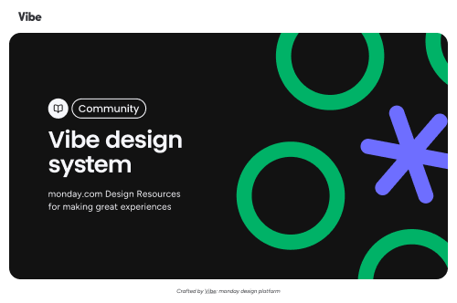

# Vibe UI Kit by monday.com (Community)

**Source:** Figma file `WRW0K7QGtF3zV6GCC9gJzD`
**Captured:** 2026-05-19
**Priority:** skip
**Status:** stub — not yet absorbed

## Pages (55)

- `14848:0` — 👋 Getting started _(4 top-level frames)_
- `16110:10847` — Release notes _(1 top-level frames)_
- `46810:1688` — Table of Contents _(1 top-level frames)_
- `46810:1689` — - _(0 top-level frames)_
- `14812:9205` — ■ Typography _(1 top-level frames)_
- `46814:2218` — ■ Spacing _(1 top-level frames)_
- `46814:2892` — ■ Elevation _(1 top-level frames)_
- `46814:454` — ■ Colors _(1 top-level frames)_
- `46817:1236` — ■ Border radius _(1 top-level frames)_
- `46814:453` — - _(0 top-level frames)_
- `46939:2840` — ❖ Accordion _(2 top-level frames)_
- `46939:7880` — ❖ Alert Banner _(2 top-level frames)_
- `46939:7881` — ❖ Attention Box _(2 top-level frames)_
- `46939:7882` — ❖ Avatar _(2 top-level frames)_
- `46939:7883` — ❖ Avatar Group _(2 top-level frames)_
- `46939:7884` — ❖ Badge _(2 top-level frames)_
- `46939:7885` — ❖ Breadcrumbs Bar _(2 top-level frames)_
- `46939:7886` — ❖ Button _(2 top-level frames)_
- `46939:7887` — ❖ Button Group _(2 top-level frames)_
- `46939:7888` — ❖ Checkbox _(2 top-level frames)_
- `46939:7889` — ❖ Chips _(2 top-level frames)_
- `46939:7890` — ❖ Combobox _(2 top-level frames)_
- `46939:7891` — ❖ Counter _(2 top-level frames)_
- `46939:7892` — ❖ Date Picker _(2 top-level frames)_
- `46939:7893` — ❖ Dialog _(2 top-level frames)_
- `46939:7894` — ❖ Divider _(2 top-level frames)_
- `46939:7895` — ❖ Dropdown _(2 top-level frames)_
- `46939:7896` — ❖ Editable Heading _(2 top-level frames)_
- `46939:7897` — ❖ Editable Text _(2 top-level frames)_
- `46939:7898` — ❖ Empty state _(2 top-level frames)_
- `46939:7899` — ❖ Icon Button _(2 top-level frames)_
- `46939:7900` — ❖ Label _(2 top-level frames)_
- `46939:7901` — ❖ Linear Progress Bar _(2 top-level frames)_
- `46939:7902` — ❖ Link _(2 top-level frames)_
- `46939:7903` — ❖ List _(2 top-level frames)_
- `46939:7904` — ❖ Loader _(2 top-level frames)_
- `46939:7906` — ❖ Menu _(2 top-level frames)_
- `46939:7907` — ❖ Modal _(2 top-level frames)_
- `46939:7908` — ❖ Multi Step Indicator (Wizard) _(2 top-level frames)_
- `46939:7909` — ❖ Radio Button _(2 top-level frames)_
- `46939:7910` — ❖ Search _(2 top-level frames)_
- `46939:7911` — ❖ Skeleton _(2 top-level frames)_
- `46939:7912` — ❖ Slider _(2 top-level frames)_
- `46939:7913` — ❖ Split Button _(2 top-level frames)_
- `46939:7914` — ❖ Steps _(2 top-level frames)_
- `46939:7915` — ❖ Table _(2 top-level frames)_
- `46939:7916` — ❖ Tabs _(2 top-level frames)_
- `46939:7917` — ❖ Text Area _(2 top-level frames)_
- `46939:7918` — ❖ Text Field _(2 top-level frames)_
- `46939:7919` — ❖ Tipseen _(2 top-level frames)_
- `46939:7920` — ❖ Toast _(2 top-level frames)_
- `46939:7921` — ❖ Toggle _(2 top-level frames)_
- `46939:7922` — ❖ Tooltip _(2 top-level frames)_
- `49719:70961` — --- _(0 top-level frames)_
- `49719:70962` — ⚒️ Utils _(2 top-level frames)_

## Skip

_TBD_

## Absorb

_TBD_

## Tension

_TBD_

## Decisions

_None yet._

## Open follow-ups

- Render previews of priority pages and write per-page NOTES.md
