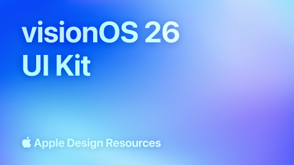

# visionOS 26 (Community)

**Source:** Figma file `PqYFseY67Eke1Vrc4jO8XR`
**Captured:** 2026-05-19
**Absorbed:** 2026-05-22 (platform-aware lens)
**Priority:** medium (re-bucketed from skip — speculative)
**Status:** absorbed — no new components; future-proofing reference

> Grounded by [`design/platform-awareness.md`](../../design/platform-awareness.md).
> Apple's spatial-computing OS for Vision Pro. **Not a current TUX
> target** — TTI has no spatial-computing consumer surface. Absorbed
> for future-proofing only.

## What it is

Apple's official **visionOS 26** UI Kit. 39 pages covering spatial
UI conventions: depth-stacked windows, gestures (look + pinch),
share/SharePlay surfaces, sidebar idioms for the spatial canvas.

The kit is a near-clone of the iOS / macOS UI kits with **depth
and parallax** baked into materials. The same Liquid Glass material,
but the glass now sits in 3D space.

## Pages (39)

Selected highlights:

- `0:3861` — **Examples** _(12 frames — sample spatial-app
  surfaces)_
- `215:105157` — Materials _(1 frame — spatial Liquid Glass)_
- `0:2194` — Text Styles _(14 frames — type at spatial distances)_
- `487:18084` — **Backgrounds** _(2 frames — translucent backdrops
  with parallax)_
- `548:1745` — **Gestures** _(2 frames — look+pinch, drag, scroll
  in 3D)_
- `487:11587` — Navigation Bars _(2 frames)_
- `487:16338` — Sidebars _(2 frames — spatial sidebar)_
- `487:15873` — **Share Sheets** _(2 frames — spatial share)_
- `487:17807` — **SharePlay** _(3 frames — multi-user spatial
  collab)_
- `487:14493` — Tab Bars _(2 frames)_
- `487:17916` — **Window Controls** _(2 frames — spatial window
  manipulation)_
- All standard controls (Alerts / Buttons / Color Pickers / Lists
  / Menus / Notifications / etc.) — most are visual ports of iOS
  with depth.

## Why this file isn't a TUX absorption target right now

- **No TTI consumer ships to Vision Pro.** Landscape and tti-ai-
  studio are desktop + web; no spatial roadmap.
- **Tauri doesn't target visionOS.** Tauri's mobile target is iOS/
  Android; spatial would need a different runtime.
- **Web-on-Vision is the realistic path.** Safari on Vision Pro
  renders web apps as flat windows in 3D space; no spatial API
  beyond standard web platform. TUX on web in a Vision Pro Safari
  window already works (renders as a flat panel).

## Skip

- **Spatial-canvas-specific patterns.** Look+pinch gestures,
  parallax materials, depth stacking, SharePlay — all out of scope
  for current TTI surfaces.
- **The "Spatial Liquid Glass" variant.** Same constrained-use
  stance as flat Liquid Glass; we don't adopt it.
- **Window Controls in 3D space.** Vision Pro draws its own; no
  app-side work.

## Absorb

1. **Reduced-motion + reduced-transparency apply doubly here.**
   On visionOS, motion sickness is a real risk; Apple enforces
   `prefers-reduced-motion` strictly. TUX already honors this
   everywhere; the future-proofing note is to **never add motion
   that ignores the preference, even on "delight" affordances.**
   We already follow this stance; reaffirming.

2. **Web-on-Vision rendering.** If a TTI researcher opens Landscape
   in Safari on a Vision Pro, the app renders as a flat 2D panel
   in 3D space. **No changes required.** This is a free win of
   building on the web.

## Tension

- **"Build a spatial Landscape" temptation.** No consumer surface
  exists. Resist.
- **The polish of Apple Design Resources is seductive.** Their
  kits are well-made. Same lesson as iOS / macOS / Liquid Glass:
  great execution of a different identity. Hold the line.

## Decisions

- **No new components.** No spatial surface on TUX's roadmap.
- **Reaffirm reduced-motion / reduced-transparency** discipline
  for the broader TUX codebase (already in place; no change).
- **Move file from skip → medium** for taxonomic consistency
  (it's an Apple Design Resources kit alongside iOS / macOS /
  iPadOS). In practice it stays a reference, not a source.

## Open follow-ups

- None. If TTI ever explores a spatial surface (unlikely in the
  near term), revisit this file as the canonical reference.
